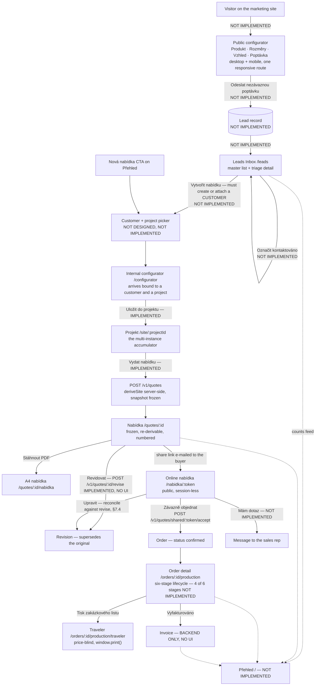
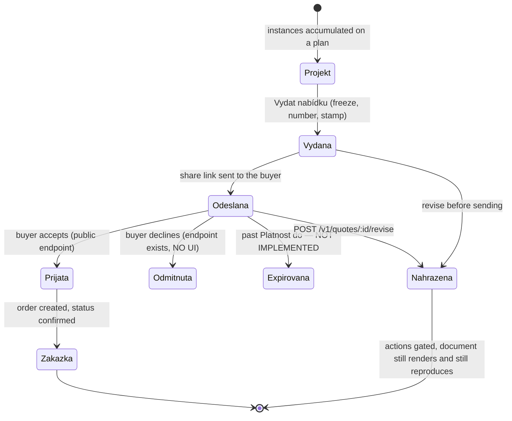
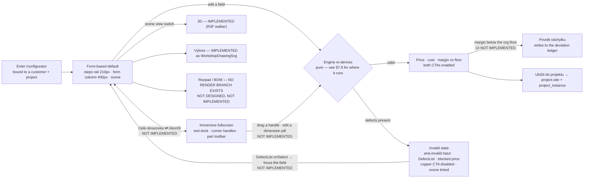
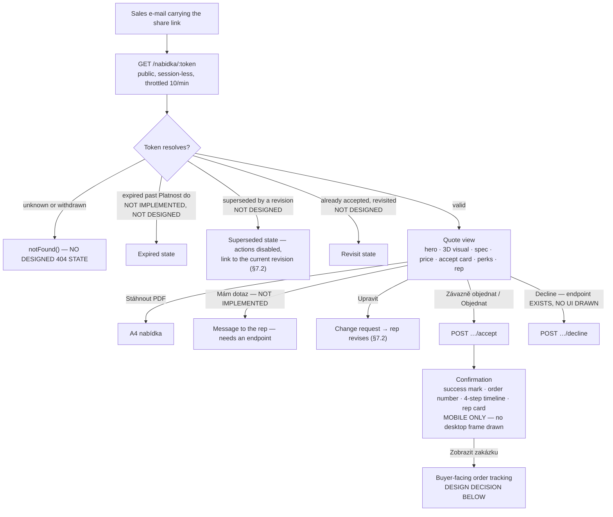
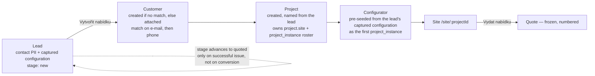
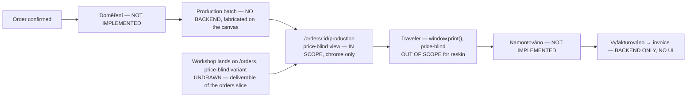

# `design/` — the design canvas export and its implementation contract

This document is the implementation contract for adopting the Perimetra design canvas. It is written for a reader with no session context: everything needed to plan, sequence and execute the adoption is stated here or pointed at precisely. The governing decision record is [`docs/adr/0114-design-canvas-adoption.md`](../docs/adr/0114-design-canvas-adoption.md); this file is the running gap-and-decision log that ADR names.

---

## 1. What this directory is

This directory is the verbatim export of the Perimetra design canvas authored on claude.ai/design and delivered on 2026-07-20. It contains:

| Path | What it is |
| --- | --- |
| `design/*.html` (nine files) | The nine rendered screen boards. |
| `design/configurator/frames-*.jsx` | The React frame modules those boards mount. |
| `design/configurator/parts.jsx` | First-generation shared domain chrome (see §1.4). |
| `design/configurator/doc-page.js` | The vendored A4 print shell. |
| `design/_ds/perimetra-design-system-0f4e8eb1-8530-4316-9866-ab32e08b499f/` | A compiled subset of this repository's own design-system bundle (see §1.2). |
| `design/uploads/Design handout - Perimetra (for Claude Design).md` | **The brief that was fed to the canvas.** It is part of the design authority: it states the intent behind every screen, ranks coverage priorities, and declares which features are NOW versus V1. Read it alongside the boards; where a board is silent, the handout is the next authority. |

### 1.1 Authority and immutability

**These files are the design authority for the Perimetra product UI.** Where the export and the currently implemented UI disagree, the export wins. The UI shipped in `apps/web` today carries no design authority whatsoever — it is throwaway low-fidelity scaffolding produced to prove backend behaviour, and it is expected to be replaced surface by surface.

**These files are reference bytes and must never be reformatted.** The directory is prettierignored. Do not run `pnpm format` against it, do not "fix" the inline pixel values, do not convert `React.createElement` calls to JSX, do not tokenise the deliberately raw hex values (the RAL swatch colours, the `#f3f1ec`/`#e7e4dd`/`#dcd8cf` studio gradient, the `rgba(0,0,0,.045)` floor-grid lines, the `#17140f` phone bezel). The value of this directory is that it is byte-comparable against the canvas; edits destroy that. A CI check enforcing this is a ship-bar item (§8.2).

### 1.2 Provenance: the export is an outbound build of this repository

The token and component **payload** of the export is byte-identical to the locally generated `ds-bundle/`: `styles.css`, `_ds_bundle.css` and `_ds_bundle.js` all match by md5. That is the substantive evidence. Note that `styles.css` is a 57-byte file containing two `@import` lines and proves nothing on its own — cite `_ds_bundle.css` and `_ds_bundle.js`.

The export is **not** a copy of the `ds-bundle/` directory. It is a compiled subset:

- The export carries `_ds_manifest.json` and `_adherence.oxlintrc.json`, which `ds-bundle/` lacks.
- `ds-bundle/` carries build and sync metadata the export lacks: `.bundle-entry.mjs`, `.ds-build-meta.json`, `_ds_sync.json`, `.sync-diff.json`, `.resync-verdict.json`, `.render-check.json`, `.stories-map.json`, `.review.html`, `_ds_needs_recompile`, plus `components/`, `_preview/`, `_screenshots/`, `guidelines/`, `tokens/` and `_vendor/`.
- `README.md` differs between the two directories. Which README governs is therefore a live question — prefer this file and the ADR over either.

**What actually proves outbound provenance** is `ds-bundle/.bundle-entry.mjs`, which re-exports absolute local paths under `/home/dchozen1/perimetra/packages/ui/src/`, together with `.ds-build-meta.json` (`{"namespace":"PerimetraUI","source":"@repo/ui@0.0.0","shape":"package","componentCount":35}`). The bundle is a build of this repo pushed *to* the canvas, not an inbound design system with an independent vocabulary. The canvas project UUID `0f4e8eb1-8530-4316-9866-ab32e08b499f` matches on both sides.

The practical consequence: all 69 tokens declared in `tooling/tailwind-config/theme.css` resolve, all **36** distinct `var(--…)` references used across the boards and frames exist, and there are zero value mismatches or unknown tokens. The canvas has not drifted from the repo.

### 1.3 The export-refresh mechanism

`ds-bundle/` is the local end of a design-sync channel (`.design-sync/`, `DesignSync` tooling). Its ledger files are `_ds_sync.json` (a `styleSha` scalar plus a 105-entry `sourceHashes` map — **all component `.jsx`/`.d.ts`/`.prompt.md` paths, zero CSS**, so that map does not contribute to style-drift detection at all), `.sync-diff.json`, `.resync-verdict.json`, `.render-check.json` and the `_ds_needs_recompile` marker.

Rules for draining a new canvas revision:

1. A new export **replaces** `design/` wholesale. Never hand-merge into it.
2. Before replacing, record the delta: run the design-sync diff and keep the resulting verdict alongside the ADR that authorises the change.
3. **A drift verdict is reconciled by the seat working this repo, not by the canvas.** If `.sync-diff.json` reports `styleChanged: true` or `_ds_needs_recompile` is present, the correct action is to recompile the bundle from `packages/ui/src` and `tooling/tailwind-config/theme.css` and re-push, so the canvas is refreshed *from* the repo. The repo is upstream of the canvas, never the reverse.
4. Every replacement of `design/` gets an ADR, because the design authority is changing.

`_ds_sync.json`'s `styleSha` recipe is **not** a plain hash of `theme.css`, `_ds_bundle.css` or `styles.css`, nor of any obvious concatenation of them. Do not rely on a specific recipe until it has been read out of `.ds-sync/lib/`.

`design/_ds/…/_adherence.oxlintrc.json` is a shipped **design-adherence oxlint configuration**. Decision: **wire it into `pnpm lint` as a separate, non-blocking `lint:design` task during the first surface, and promote it to blocking once the first two surfaces pass it clean.** It is the only automated adherence gate that ships with the export, and leaving it unwired means the export's own rules are enforced by hand review only.

### 1.4 `parts.jsx` is superseded chrome, not shipped composition

`parts.jsx` has **no ES exports at all**. It assigns a global: `window.PConf = { h, UI, Icons, I, STEPS, RAL, Enum, AppBar, Stage3D, PricePanel, ValidationPanel, RailHead, money }`.

**No frame renders `AppBar`, `PricePanel`, `ValidationPanel` or `RailHead`.** They are the first-generation configurator chrome, superseded by `frames-v2.jsx`, which inlines its own context bar, scene, commercial panel and invalid form. Treat them as design intent still worth implementing — particularly the `PricePanel` cost → margin → sell ladder, the blocked-price state, and the `hudChip(v, hz)` floating-chip recipe — but never as the shipped composition.

Likewise the phone bezels, iOS status bars, `frameShell`, canvas labels, chips, step captions and dashed flow connectors are canvas annotation and device mockery. They are never implemented.

`parts.jsx` also carries a **contradictory quote-building model** (an app bar reading `Nabídka celkem · 3 položky · 132 400 Kč`, a CTA `Přidat do nabídky`). That model is wrong and is settled against in §3.1 — a Perimetra quote is per-site and multi-instance, and the accumulator is a persistent server-side project roster, not a cart.

---

## 2. The prerequisite slice (must land before the first surface)

Four defects and two token gaps must be closed before any surface is reskinned. Each one, decided per surface instead of centrally, produces nine inconsistent answers.

### 2.1 Defect A — the app's dark token flip is root-only

`tooling/tailwind-config/theme.css:156` declares `@variant dark { … }` at stylesheet top level. With no parent rule, the `&` resolves to `:scope`, so the block compiles to `:scope:where(.dark, .dark *)` and matches **only `html.dark`**. Meanwhile the `dark:` utilities compile with a real parent (`.dark\:bg-background:where(.dark, .dark *)`) and match at any depth. The result: a scoped `.dark` subtree gets dark utilities over light token values.

`apps/web/app/brand-lab/brand-lab-client.tsx:204` applies `.dark` to a `<div>`, so `/brand-lab?theme=dark` — the standing eyes-on verification route — renders half-flipped today and is misreporting.

**Fix, one line at `theme.css:156`:**

```diff
-@variant dark {
+.dark {
```

This was verified by recompiling with `@tailwindcss/cli@4`: it emits `.dark { … }` with all 47 declarations intact at the identical output position (unlayered, after `@layer utilities`). It is strictly value-preserving — custom properties inherit, so the `.dark *` half is unnecessary for token declarations, and `html.dark` still matches `.dark`.

### 2.2 Defect B — the exported bundle's dark layer is invalid CSS

`ds-bundle/_ds_bundle.css:2294-2342` emits 47 custom-property declarations directly inside `@media (prefers-color-scheme: dark)` with **no enclosing selector**. Browsers discard them, so every dark override in the shipped bundle is dead.

Root cause is the same top-level `@variant` bug seen through a different compile entry. `.design-sync/tailwind-entry.css:2` imports `../tooling/tailwind-config/theme.css` directly but **never registers `@custom-variant dark`** — that line exists only in `apps/web/app/globals.css:6`. Without it, Tailwind v4's stock `dark` variant is the media query, and wrapping a top-level `@variant` body in a media query yields selectorless declarations.

**Fix, two parts:**

1. Apply the Defect A fix. A real `.dark` selector survives into any entry.
2. **Move `@custom-variant dark (&:where(.dark, .dark *));` into `tooling/tailwind-config/theme.css` itself**, so every consumer inherits it and no future entry point can forget it. This is preferred over patching `.design-sync/tailwind-entry.css`, because the duplication between `globals.css` and the sync entry is itself the hazard class.

Then regenerate per `.design-sync/NOTES.md`:

```bash
pnpm dlx @tailwindcss/cli@4 -i .design-sync/tailwind-entry.css -o .design-sync/compiled-tailwind.css
cp .design-sync/compiled-tailwind.css packages/ui/.ds-css/
```

### 2.3 Defect C — the unenforced `theme.css` copy

`.design-sync/config.json:8` sets `"tokensGlob": ".ds-css/theme.css"`. That file is a **hand-maintained copy** of `tooling/tailwind-config/theme.css`. They are byte-identical today (md5 `159f4c2c529b0370304b5dcfae7d281a` on both), but nothing enforces it — no test, no lint rule, no CI step. `.design-sync/NOTES.md:13-14` instructs keeping it in sync by hand and `NOTES.md:54` records that it goes stale silently.

The failure mode is invisible drift: edit `theme.css` → forget the copy → `styleSha` is computed from the stale copy and does not change → design-sync reports no style change.

**The complication that decides the fix:** `packages/ui/.ds-css/` is **not tracked by git** (`git check-ignore` reports it excluded via `.git/info/exclude:27`). A comparison test is therefore unworkable — the file does not exist in CI or a fresh clone, so the test either fails universally or skips and enforces nothing. A committed symlink is unworkable for the same reason.

**Fix: generate it, do not check it.** Script the whole preflight so both copies and the Tailwind compile happen in one command — `scripts/design-sync-preflight.mjs`, doing at minimum:

```bash
cp tooling/tailwind-config/theme.css packages/ui/.ds-css/theme.css
pnpm dlx @tailwindcss/cli@4 -i .design-sync/tailwind-entry.css -o .design-sync/compiled-tailwind.css
cp .design-sync/compiled-tailwind.css packages/ui/.ds-css/
```

Since `.ds-css/` is generated and untracked, regenerating it is free and always correct; nothing is authored there, so there is nothing to keep in sync.

If a CI guard is additionally wanted, it must sit on the *tracked* side: assert that `.design-sync/tailwind-entry.css` imports the canonical `tooling/tailwind-config/theme.css`. That is checkable in a fresh clone; the `.ds-css` copy is not.

### 2.4 Gap A — no spacing scale exists

`theme.css` declares zero `--spacing*`/`--space-*`/`--size-*` tokens (the only `spacing` matches are `--text-*--letter-spacing` sub-properties). The canvas compensated with 256 hardcoded `gap:` values, 171 `padding:` values and 290 `fontSize:` values.

Measured `gap` distribution clusters at 4/6/8/10/12/14/16 (2, 3, 5, 7, 9, 11 are noise between rungs). Ship this scale:

```css
--spacing-3xs: 0.125rem; /*  2px */
--spacing-2xs: 0.25rem;  /*  4px */
--spacing-xs:  0.375rem; /*  6px */
--spacing-sm:  0.5rem;   /*  8px */
--spacing-md:  0.625rem; /* 10px */
--spacing-lg:  0.75rem;  /* 12px */
--spacing-xl:  0.875rem; /* 14px */
--spacing-2xl: 1rem;     /* 16px */
--spacing-3xl: 1.25rem;  /* 20px */
--spacing-4xl: 1.5rem;   /* 24px */
--spacing-5xl: 1.75rem;  /* 28px */
--spacing-6xl: 2rem;     /* 32px */
```

**Snap rule** (apply centrally, never per component): canvas 2 → `3xs`; 3, 4 → `2xs`; 5, 6, 7 → `xs`; 8, 9 → `sm`; 10, 11 → `md`; 12, 13 → `lg`; 14, 15 → `xl`; 16, 18 → `2xl`; 20, 22 → `3xl`; 24, 26 → `4xl`; 28 → `5xl`.

### 2.5 Gap B — the body type ramp

The canvas improvised a 23-step ramp with half-pixel steps. Collapse it to 11 rungs. Counts are canvas occurrences, which is why the weight sits on `xs`/`sm`/`base`.

| Token | px | Absorbs (occurrences) |
| --- | --- | --- |
| `--text-2xs` | 10 | 10, 10.5 (5) |
| `--text-xs` | 11 | 11, 11.5 (46) |
| `--text-sm` | 12 | 12, 12.5 (98) |
| `--text-base` | 13 | 13, 13.5 (59) |
| `--text-md` | 14 | 14, 14.5 (16) |
| `--text-lg` | 15 | 15, 15.5 (27) |
| `--text-xl` | 16 | 16, 17 (10) |
| `--text-2xl` | 18 | 18, 19 (8) |
| `--text-3xl` | 20 | 20, 21 (2) |
| `--text-4xl` | 22 | 22, 23, 24 (12) |
| `--text-5xl` | 28 | 26, 30 (4) |

```css
--text-2xs: 0.625rem;   --text-2xs--line-height: 1.4;
--text-xs:  0.6875rem;  --text-xs--line-height:  1.4;
--text-sm:  0.75rem;    --text-sm--line-height:  1.45;
--text-base:0.8125rem;  --text-base--line-height:1.5;
--text-md:  0.875rem;   --text-md--line-height:  1.5;
--text-lg:  0.9375rem;  --text-lg--line-height:  1.45;
--text-xl:  1rem;       --text-xl--line-height:  1.4;
--text-2xl: 1.125rem;   --text-2xl--line-height: 1.35;
--text-3xl: 1.25rem;    --text-3xl--line-height: 1.3;
--text-4xl: 1.375rem;   --text-4xl--line-height: 1.25;
--text-5xl: 1.75rem;    --text-5xl--line-height: 1.2;
```

These sit **below** the existing editorial `--text-title` (32), `--text-metric` (40) and `--text-display` (96), which stay unchanged. There is no collision.

### 2.6 Gap C — interaction-state colours

The only interaction token in `theme.css` is `--color-copper-hover`. Nothing exists for `primary`, `secondary`, `chrome`, `nav-active`, `destructive`, `success`, `warning` or `info`. The canvas improvised with five ad-hoc `color-mix()` calls.

Do **not** hardcode a lighten/darken direction: in light mode hover means darker, in dark mode lighter. Mix toward `--color-foreground`, which already inverts per theme. One declaration, both themes correct, no dark-block duplication:

```css
--color-primary-hover:      color-mix(in oklch, var(--color-primary)      88%, var(--color-foreground));
--color-primary-active:     color-mix(in oklch, var(--color-primary)      78%, var(--color-foreground));
--color-secondary-hover:    color-mix(in oklch, var(--color-secondary)    88%, var(--color-foreground));
--color-secondary-active:   color-mix(in oklch, var(--color-secondary)    78%, var(--color-foreground));
--color-chrome-hover:       color-mix(in oklch, var(--color-chrome)       88%, var(--color-foreground));
--color-chrome-active:      color-mix(in oklch, var(--color-chrome)       78%, var(--color-foreground));
--color-nav-active-hover:   color-mix(in oklch, var(--color-nav-active)   88%, var(--color-foreground));
--color-destructive-hover:  color-mix(in oklch, var(--color-destructive)  88%, var(--color-foreground));
--color-destructive-active: color-mix(in oklch, var(--color-destructive)  78%, var(--color-foreground));
--color-success-hover:      color-mix(in oklch, var(--color-success)      88%, var(--color-foreground));
--color-warning-hover:      color-mix(in oklch, var(--color-warning)      88%, var(--color-foreground));
--color-info-hover:         color-mix(in oklch, var(--color-info)         88%, var(--color-foreground));

--opacity-disabled: 0.45;
```

Ladder: **hover 88 % / active 78 % / disabled 45 % opacity.**

One deliberate exception: `--color-copper-hover` stays hand-authored. Its existing values match the mix-toward-foreground direction but are hand-tuned for the brand CTA; the derived rule covers everything else.

### 2.7 Acceptance criteria for the prerequisite slice

The slice is done when all of the following hold. This is the exit condition; nothing below it starts a surface.

1. `theme.css:156` reads `.dark {`, and `@custom-variant dark (&:where(.dark, .dark *));` lives in `theme.css`.
2. `ds-bundle/_ds_bundle.css` contains no selectorless declarations inside `@media (prefers-color-scheme: dark)` after regeneration.
3. `scripts/design-sync-preflight.mjs` exists, runs both copies plus the compile in one command, and is referenced from `.design-sync/NOTES.md`.
4. The 12 spacing tokens, the 11 body type rungs and the 13 interaction tokens are declared in `theme.css`.
5. `/brand-lab` is **extended** to display the new spacing, type and interaction-state tokens — otherwise the wave adds vocabulary with no eyes-on surface.
6. **`/brand-lab?theme=dark` is captured headlessly (`verify-3d-headless` capture path) and the PNGs are read and confirmed fully dark.** This is the slice's acceptance artifact. Per Martin's standing rule, correctness is not claimed from tests and arithmetic alone.
7. The full repo gate is green (§8.1 item 7).

---

## 3. The domain model the design must be built against

Two model questions determine the shape of half the screens. Both are settled by the repo, not by the canvas, and both are settled here.

### 3.1 A quote is per-site and multi-instance; the accumulator is a project

`packages/validators/src/quotes.ts:44` takes `instances: z.array(quoteInstanceInputSchema).min(1)` alongside `site: z.unknown()`. There is no single-instance issue path. `apps/api/src/modules/quotes/quotes.service.ts` runs the pure `deriveSite` server-side and freezes the snapshot. `packages/engine/src/site.ts:196` returns a `SiteResult` whose `bom: SiteBomLine[]` merges `(component, unit, category)` across instances and carries `sources: {instanceId, path}[]` — multi-item is baked into the BOM row shape itself. `SiteStamps.releaseIds` is `Record<instanceId, releaseId>`, so I3 reproducibility is defined over a **roster**, not an item. `CORE_SPEC.md:283` agrees.

**There is no cart and there must not be one.** The accumulator is already a durable server-side table: `project_instance` (`{instanceId, releaseId, input, overrides?}`) mirrors `quoteInstanceInputSchema` exactly, so a saved project is issue-ready. `apps/web/app/site/persistence.ts:104` `appendInstanceToDocument` is the accumulate action — append one `(releaseId, input)` pair to a project's site document via `PUT /projects/:id/site` with `expectedVersion` optimistic locking (ADR 0054). A client-side `useState` cart would be a second, lossy, unlocked copy of a table that already exists.

**The shipped CTAs, which the design must use:**

| Where | String | Source |
| --- | --- | --- |
| Configurator primary CTA | **Uložit do projektu** | `packages/i18n/src/messages/cs.ts:248,255`; asserted in `save-to-project-panel.test.tsx:55` |
| Site canvas, next to the customer/§92e picker | **Vydat nabídku** | `cs.ts:461-462`; `apps/web/app/site/issue-quote-panel.tsx` |

`frames-v2.jsx`'s `Uložit do projektu` is exactly right. Its sibling `Vytvořit nabídku` is the right idea on the wrong screen — issuing is a legal act (numbering, buyer freeze, margin floor) and belongs on `/site/[projectId]`; the shipped verb is **Vydat**. `parts.jsx`'s `Přidat do nabídky` plus a running `Nabídka celkem · 3 položky` app bar is wrong twice: it names the accumulator *nabídka* when the accumulator is a *projekt*, and it implies ephemeral session state where the repo has a locked table.

**The mental model to design against:** *Projekt* accumulates instances on a plan → *Nabídka* is one frozen, numbered, reproducible document over that whole site. One project can yield several nabídky over time as a revision chain.

### 3.2 What the Nabídky detail screen therefore shows

Not one product card. A frozen multi-instance site document:

- Document header — `documentNumber` (gap-free `{year}/{seq:04d}`, ADR 0079), status, validity, frozen buyer identity, `revisionOfId`/`supersededById` lineage (`quoteSummarySchema`, `quotes.ts:82-103`).
- The **aggregated site BOM** with per-instance provenance.
- Totals with the DPH / §92e breakdown.
- The buyer share link.
- The **Ověřitelná nabídka** trust panel (`cs.ts:443-450`): *"Tuto nabídku lze kdykoli znovu odvodit z jejích zafixovaných vstupů — bajt po bajtu stejně (I3)"*, with a live **Ověřit reprodukovatelnost** button hitting `verifyReproducibility`. This is the thing no competitor has; it is a first-class design element, not a footnote.
- A link to the price-blind `/production` traveler for the shop floor (ADR 0108).

---

## 4. Target information architecture

### 4.1 The invariant registry

**The rail item set is invariant.** Every authenticated screen renders the same registry, filtered only by role. Nothing is ever omitted per screen. The canvas contradicts itself here — `Přehled` appears in the Katalog and Dashboard rails but not in the Inbox or Zakázky rails; those are drawing bugs, not a design. Active state and *density* change across breakpoints; **membership never does.** Count pills are a property of the registry entry, so they render at every breakpoint with room; the tablet Přehled rail dropping counts is a bug.

The registry file already exists at `apps/web/lib/nav-registry.ts` and is the artifact to rewrite. Glyphs come from `design/configurator/parts.jsx:16-37`.

| # | Label | key | Route | Glyph | Count pill | Group |
| --- | --- | --- | --- | --- | --- | --- |
| 1 | Přehled | `dashboard` | `/` | `layers` | none | main |
| 2 | Poptávky | `leads` | `/customers` ⌛ → `/leads` | `post` | leads at stage `new` — **none until the leads module exists** | main |
| 3 | Nabídky | `quotes` | `/quotes` | `draft` | open quotes (`draft` + `sent`) | main |
| 4 | Zakázky | `orders` | `/orders` | `list` | active orders (not `completed`/`cancelled`) | main |
| 5 | Katalog | `catalog` | `/configurator` | `cube` | none | main |
| 6 | Nastavení | `settings` | `/settings` | `scale` | none | footer |
| 7 | Platforma | `platform` | `/platform` | `cube` | none | footer |

Items 6–7 are the footer group, separated by a rule and pinned with `margin-top: auto`. Platforma sits directly above Nastavení; it is a **tier**, not a peer surface.

Two things the canvas assumes that do not exist:

- **`/leads` has no backend.** No leads module exists in `apps/api/src/modules`. The `leads` entry ships now, labelled Poptávky, pointed at `/customers`, **with no count pill** — an empty pill is worse than none. When the leads module lands, the index moves to `/leads` and `/customers` becomes its second tab. The role gate is identical either way.
- **`/settings` has no route.** It must be created as a tabbed section index; it absorbs five currently-orphaned routes.

**Count-pill data:** one endpoint, `GET /v1/me/nav-counts` → `{ leads?, quotes?, orders? }`, server-side role-filtered so a workshop session's payload cannot leak a count it may not see. Invalidate on the existing `org:<id>` realtime channel (ADR 0055) rather than polling.

**Katalog is two-tiered, and that is what the canvas conflates.** `frames-catalog.jsx:31-38` draws product families with *rule counts* and a rule-table editor — that is the vendor model-IDE (`/platform/releases/*`), not a tenant surface. For an org member, Katalog is `/configurator` plus the price/ceník half of `/admin`. For the platform operator, rule-editing depth lives under Platforma. Same glyph, two tiers.

### 4.2 Disposition of every existing route

Thirty `page.tsx` files exist, and the tables below account for all thirty. Note that there is **no bare `/site`** (only `/site/[projectId]`) and **no `/orders/[id]`** — the order detail *is* `/orders/[id]/production`. The invite param is `[invitationId]`.

**Survives as a child of a top-level item:**

| Route | Parent | Disposition |
| --- | --- | --- |
| `/` | — | **Přehled itself.** Currently the skeleton demo home; replaced with the dashboard per `frames-dashboard.jsx`. |
| `/configurator` | Katalog | Section index. |
| `/projects` | Nabídky | Tab **Rozpracované**. A project is a pre-issue quote; it belongs to the quote section, not its own rail slot. |
| `/site/[projectId]` | Nabídky | Detail; back → `/projects`. |
| `/quotes` | Nabídky | Section index, tab **Vydané**. |
| `/quotes/[id]` | Nabídky | Detail; back → `/quotes`. |
| `/quotes/[id]/nabidka` | Nabídky | Internal preview of the buyer document; back → `/quotes/:id`. |
| `/quotes/[id]/production` | Nabídky | Price-blind production view; back → `/quotes/:id`. |
| `/orders` | Zakázky | Section index. |
| `/orders/[id]/production` | Zakázky | **The order detail.** Back → `/orders`. |
| `/customers`, `/customers/[id]` | Poptávky | Tab **Zákazníci**; interim section index plus detail. |
| `/platform`, `/platform/releases/new`, `/platform/releases/drafts`, `/platform/releases/drafts/[id]` | Platforma | Operator tier. |

**Moves under Nastavení.** `/settings` renders a tab strip; each existing route becomes a tab and keeps its URL — no redirects, no moved files.

| Route | Tab | Gate |
| --- | --- | --- |
| `/account` | Účet | any member |
| `/account/security` | Zabezpečení | any member |
| `/team` | Tým | any member (management actions already admin-gated) |
| `/team/legal-profile` | Firma | `admin` (`LegalProfilesController` is `@RequireRole("admin")` at controller level) |
| `/admin` | Ceníky | `admin` |

**`/admin` loses its top-level rail slot.** It is one price-table console — a settings surface, not a peer of Zakázky. This is a deliberate demotion from today's registry.

**Chromeless — no rail, no tabs, at any breakpoint:**

| Route | Why |
| --- | --- |
| `/login` | auth flow |
| `/two-factor` | mid-challenge; the session is not complete |
| `/accept-invitation/[invitationId]` | pre-membership; the visitor has no org to scope a rail to |
| `/nabidka/[token]` | public buyer document, unauthenticated |
| `/quotes/[id]/production/traveler` | print surface (`window.print()`, ADR 0108) |
| `/orders/[id]/production/traveler` | print surface |

The first four already match `PUBLIC_PREFIXES` in `nav-shell.tsx:17`. **The two traveler routes are a live bug** — they are not in that list, so the shell currently renders chrome into a print sheet. Add a `PRINT_PREFIXES` check on the `/traveler` suffix.

**Dropped from navigation entirely:** `/scene-lab`, `/drawing-lab`, `/brand-lab`. The routes stay (they are checked-in verification instruments) but get **no registry entry at any tier, including platform operator**, and should render `notFound()` when `TIER === "prod"`. They are reached by typing the URL.

### 4.3 Per-role filter

Roles resolve from `member.role` via `mapMemberRole` (`apps/api/src/common/rbac/org-role.ts`); `owner` → `admin`. `RolesGuard` fails closed — an unmappable role is *no* role, and an org-less session 403s. The shell mirrors that: `role: null` → only Nastavení (Účet, Zabezpečení).

| Item | admin | sales | workshop |
| --- | --- | --- | --- |
| Přehled | yes | yes | yes (job-queue KPIs only — no money tiles) |
| Poptávky | yes | yes | no |
| Nabídky | yes | yes | **no** |
| Zakázky | yes | yes | yes |
| Katalog | yes | yes | **no** |
| Nastavení | full | Účet, Zabezpečení, Tým | Účet, Zabezpečení |

Two deliberate tightenings against the current registry, both flowing from price-blindness:

- **Workshop loses Nabídky.** A nabídka is constitutively a priced document; a quote list with every money column stripped is a degraded surface, not a useful one. Workshop's legitimate need — specs and geometry for a job — is fully served by Zakázky → `/orders/:id/production` → traveler, which is price-blind by design (ADR 0108). Hiding the link removes an entire class of leak surface rather than defending it field by field.
- **Workshop loses Katalog.** The configurator prices what it configures, and workshop 403s on `/price-tables/active`. Do not route a role to a dead end.

Note that `GET /v1/quotes` and `GET /v1/orders` carry no `@RequireRole` — the `admin`/`sales` decorators at `quotes.controller.ts:66` and `orders.controller.ts:64` sit on the `@Post`s below them. Hiding the nav link is therefore **chrome-level only**. If workshop must be hard-blocked from the quotes list, that is a separate controller change, not a registry one.

**Platform-operator tier** (`user.role='admin'` → `PlatformGuard`, ADR 0062) is orthogonal to org role. It adds exactly one item, Platforma, and nothing else. Both `useRole` and `usePlatformAdmin` already fail closed while `/v1/me` resolves. `PlatformGuard` 403s `mfa_required` until TOTP enrolment (ADR 0070), so the Platforma entry renders even pre-enrolment and lets the guard's error route the operator to `/account/security` — hiding it would strand them.

### 4.4 The one collapse rule

One rule, three renderings. **Membership never changes; only density.**

**Desktop (≥ 1280 px) — 220 px labelled rail.** Glyph, label, count pill (`margin-left: auto`); Nastavení pinned bottom via `margin-top: auto` (`frames-dashboard.jsx:32`; the main-group items are at `:31`). Platforma is this document's addition for the platform-operator tier — it appears in no canvas frame, and it is pinned alongside Nastavení by the same rule.

**Tablet (768–1279 px) — 68 px icon rail.** Glyph only, label as `aria-label` plus a real `Tooltip` (not `title=`). **The rail is always present.** `frames-catalog.jsx:181-187` renders none, stranding the user at 1024 px with no way off the screen — that is an accessibility defect and **must not be reproduced**. **Counts render at this breakpoint too**, as a superscript numeric badge on the glyph's top-right; the Přehled tablet frame dropping them is a bug.

**Mobile (< 768 px) — bottom tab bar.** `flex`, copper active state, `padding-bottom: calc(10px + env(safe-area-inset-bottom))`, per `frames-inbox.jsx:304-308`.

- The bar renders registry items 1–5 (the main group), capped at five. Counts become a dot badge on the glyph.
- **The footer group — Nastavení and Platforma — is never a tab.** It lives behind the avatar button in the mobile top app bar. This is one rule, not an exception: *footer-grouped items collapse into the app-bar menu on mobile.* It also reproduces the canvas's instinct to omit Nastavení without special-casing it.
- Workshop filters to three items and sales/admin to five, so the bar is never over-full and never needs a "More" tab.

**Mobile detail screens.** The canvas drops the tab bar entirely (`FrameMobileDetail`), leaving no escape. Corrected rule, in two parts:

1. **Every detail screen renders a top app bar with a Zpět control linking to its owning section index** — a *registry-derived parent link*, never `history.back()`. Deep-linking into `/customers/:id` from an e-mail must still resolve to `/customers`. The parent chain is exactly the Parent column in §4.2.
2. **The bottom tab bar stays visible on detail screens by default.** It is hidden only when the screen owns a primary bottom action bar: `/configurator` (wizard nav) and the two `/traveler` print routes (chromeless anyway). Everywhere else the user has both escapes — up via Zpět, lateral via the tabs.

**Hard requirement, applying to all three renderings: every reduced layout retains an escape affordance.** No breakpoint may produce a screen with no way out.

### 4.5 Implementation notes for the shell

- Rewrite `apps/web/lib/nav-registry.ts`: entries gain `icon`, `group: "main" | "footer"`, `countKey?` and `children?` (the tab strips). `visibleNavEntries` stays the single filter, and the three chrome renderers are pure consumers of it — that is what makes "membership is invariant" enforceable rather than aspirational.
- `apps/web/components/nav-shell.tsx` splits into `<SideRail>` / `<IconRail>` / `<TabBar>` over the same registry, per the composition mandate.
- There are currently **no route groups and exactly one layout** (`app/layout.tsx`), carrying fonts, the CSP nonce, the no-FOUC theme script and i18n bootstrap, and no visual design. Introducing an authenticated app-shell layout is a **new file**, not an edit to that one.
- New i18n keys under `nav`: `dashboard`, `leads`, `catalog`, `settings`. The keys `configurator`, `projects`, `customers`, `team`, `admin` and `account` stop being top-level and become tab labels.
- Fix in passing: add the `/traveler` suffix to the chromeless check in `nav-shell.tsx`.

---

## 5. The scope fence

The canvas covers nine boards. The app has thirty routes. This section states, for every surface, whether it is reskinned in this wave — and where it is not, the honest consequence.

| Surface | Verdict | Divergence consequence |
| --- | --- | --- |
| `/orders`, `/quotes`, `/projects`, `/customers`, `/configurator`, `/nabidka/*`, `app/page.tsx` | **IN** (ADR 0114 sequencing) | — |
| `/admin` (= the Katalog board; read-only for release-derived data) | **IN** | — |
| `/login`, `/team/legal-profile` | **IN** (§5 gap-fill; no board exists) | — |
| `production/` view chrome plus a **price-blind Zakázky variant** | **IN** (forced by a shared component and by the workshop having no landing surface) | none — internal |
| Token prerequisites, dark-variant fix, `/brand-lab` extension | **IN** (must land first) | — |
| Invoices | **Greenfield: scope the surface or suppress the `fakturováno` affordance** | customer-visible if the document ships |
| `/site/[projectId]` | **OUT — reskinned app shell only, contents untouched** | the differentiator will look like the oldest part of the product, mid-demo, in front of a customer |
| `traveler` print documents | **OUT** | none — shop floor |
| `/platform`, `/platform/releases/*` | **OUT** | none — vendor operator only |
| `/team`, `/account`, `/account/security`, `/two-factor`, `/accept-invitation` | **OUT** | an invitee sees `/accept-invitation` exactly once |
| `/scene-lab`, `/drawing-lab`, `/brand-lab` | **Not applicable — instruments** | none |

Detail on the non-obvious calls:

**Workshop production surfaces are split.** `apps/web/app/orders/[id]/production/` imports `ProductionView` and `TravelerDocument` from `apps/web/app/quotes/[id]/production/` — **one component, two entry points**. The orders reskin touches this whether or not it is scoped, so it must be scoped deliberately. The **screen chrome is in** (page frame, nav, back link, panel shells around `cut-list-panel.tsx` and `technical-drawing-svg.tsx`); the **traveler print document is out** — it is an A4-for-a-shop-floor artifact (ADR 0108 / ADR 0087) with no canvas frame, and reskinning it to screen tokens is a regression risk, not an improvement.

**The workshop has no landing surface, and the canvas does not draw one.** Přehled is money-dense by construction; Nabídky, Poptávky and Katalog are sales. The only honest landing surface is `/orders` rendered in a **price-blind variant** — order list filtered to `in_production`, with the value and price columns *absent* (absence, not masking, per ADR 0056). That variant is undrawn; it is filled in the canvas's spirit and is a **deliverable of the orders slice, not an afterthought**. Otherwise the wave ships a role that lands on a 403.

**The site canvas is out but must be fenced loudly.** `apps/web/app/site/` is a bespoke interaction surface — `plan-canvas.tsx`, `site-client.tsx`, `instance-panel.tsx`, `terrain-panel.tsx`, `palette.tsx`, `issue-quote-panel.tsx`, `site-results-panel.tsx` plus tested pure `derive.ts`/`persistence.ts`. The canvas has zero frames for it and no nav entry, so reskinning it would mean inventing an entire interaction design from nothing while claiming canvas authority. The configurator **is** in scope and hands off mid-flow to the site canvas, so a user will cross a visible seam inside one task. Mitigation, cheap and in scope: apply the reskinned **app shell to `/site` only** (frame, not contents), containing the seam to the canvas viewport rather than the whole page. Schedule the real design as its own board and slice immediately after this wave.

**The release editor is out.** `/platform/releases/*` (ADR 0068 Phases 1–4) is a vendor-only model IDE behind `PlatformGuard` plus mandatory TOTP MFA, with an audience of one organisation. It is the largest recently-built surface in the repo and the one where a reskin buys the least. It will look older than the product around it; that is acceptable indefinitely because no customer reaches it.

**Katalog maps to `/admin`, not `/platform`.** The board's copy is tenant vocabulary throughout — *Rodiny produktů, Ceník, Cenová pravidla, Validační limity, Standardní odstíny, Typy výplně, Přidat rodinu, Kč/m²* — with no assign, broadcast, retire or org terms anywhere. **Domain caveat:** the board draws editable product families, validation limits and colour palettes, but in the real domain that data is immutable vendor-authored release content (ADR 0062: authoring is vendor-only). **The domain wins.** `/admin` gets the Katalog look and IA for the price/ceník half and a **read-only** presentation for the release-derived half. Do not let the board's affordances imply tenant write access to release data.

**Invoices are the wave's biggest silent gap.** `apps/api/src/modules/invoices/` is a real, tested backend (`GET /invoices`, `POST /invoices`, `GET /invoices/:id`, `POST /invoices/:id/mark-paid`, `/unmark-paid`, `/verify`, with `invoice-mapper.ts`, `document-number.ts`, `tax-cz-conformance.test.ts`). There is **no invoice route, no query factory and no component in `apps/web`.** Both the Zakázky board and Přehled carry the state `fakturováno`, so the design asserts the state exists without designing the surface behind it. If not scoped, the reskinned `/orders` renders a badge that links nowhere — worse than today, because the design promises a destination that does not exist. Either build the surface in this wave (list, frozen document, mark-paid, drawn from the Nabídka board's document language, which is the right precedent since an invoice is the second frozen document class), or explicitly suppress the affordance. **Do not ship the dead badge.** Sequencing blocker: `@cardo/tax-cz` is unpublished and `buildInvoice`/`buildSpayd` are being added by the cardo seat, so the document rendering (§92e legend, per-rate VAT breakdown, QR block) cannot be finalised yet — a list and status surface can ship ahead of it.

**The eyes-on labs are instruments, not product.** Reskinning an instrument destroys its value: a lab must show tokens and geometry raw or it stops being evidence. The one exception is the `/brand-lab` dark fix and extension, which is prerequisite token work (§2), not design work.

---

## 6. Screen → route map

| Canvas board (frame module) | What it is | Target route | Verdict | Backend status |
| --- | --- | --- | --- | --- |
| `Perimetra Configurator.html` (`frames-v2.jsx`: `v2-OPT`, `v2-IMM`, `v2-INV`, `v2-TAB`, `v2-MOB`) | Internal CPQ configurator — steps rail, form column, live 3D/2D scene, rep-only cost/margin/floor block. Five frames: desktop default, immersive fullscreen, invalid config, tablet on-site, mobile wizard. | `/configurator` | **Reskin**, with one rebuild risk: `wizard-flow.ts` hard-codes a five-step Czech spine while the canvas draws seven steps. Settle the step model first (§7.1). | Exists. `fetchCatalogBundle` (releases → per-release catalogs → active price table) plus the client-side pure engine. Cost/margin layer exists (ADR 0059). |
| `Perimetra Configurator Flow.html` (`frames-flow.jsx`, 4 frames) | Public, unauthenticated lead-catcher configurator at desktop width — family picker, dimensions, colour, contact form. Terminates at lead capture. | New public route, e.g. `/konfigurator` | **Greenfield** | Must be built. No leads module exists. Also needs a public, org-attributable pricing path — the org-scoped `/v1/price-tables/active` 403s an anonymous caller. |
| `Perimetra Lead Catcher - Mobile.html` (`frames-mobile.jsx`, 4 frames) | The same public flow at 390 × 844 — progress dots instead of `StepNav`, one group per screen, sticky price + CTA bar. | The same public route, mobile layout | **Greenfield** — one responsive surface with the desktop flow, not a second route. | Same gap as above. |
| `Perimetra Leads Inbox.html` (`frames-inbox.jsx`: `INBOX`, `EMPTY`, `TABLET`, `MOBLIST`, `MOBDETAIL`) | Internal lead triage: rail, 384 px master list, detail pane with 3D preview, requested configuration, contact, triage facts, activity timeline, notes. | New `/leads` and `/leads/[id]` | **Greenfield** | Must be built in full. `grep -rniE "lead|poptav"` over `apps/api/src`, `packages/validators/src` and `packages/db/src` returns zero substantive hits. Model it on `customers` (org-scoped, per-rep ownership, `pii()` registry). |
| `Perimetra Nabidka.html` (print, `doc-page.js`) | Printable A4 quote document: vendor identity, parties, production elevation, 10-row spec, six-row price table, terms, validity pill, signature blocks. | `/quotes/[id]/nabidka` | **Reskin** | Exists. Built off the frozen quote snapshot via `buildNabidka()` from `@repo/renderers`; no re-derive. |
| `Perimetra Nabidka Online.html` (`frames-quote.jsx`: `q-DESKTOP` at 1280 × 980, `q-MOBILE`, `q-ACCEPTED`) | Buyer-facing online quote twin: hero, 3D visual, 7-row spec, price with VAT, accept card, perks, rep card; plus the mobile post-acceptance confirmation with a next-steps timeline. | `/nabidka/[token]` | **Rebuild** — the route, token model and accept/decline endpoints exist; the composition is entirely new. | Mostly exists. `GET /v1/quotes/shared/:shareToken`, `POST …/accept`, `POST …/decline`, all `@Public()` and throttled 10/min; `shareToken` minted at issue. Missing: the *Mám dotaz* message path and the *Upravit* change-request path (§7.4). |
| `Perimetra Katalog.html` (`frames-catalog.jsx`: `c-DESKTOP`, `c-TABLET` at 1024 × 1180 portrait) | Tenant-facing catalog admin: family master list plus an editor with Ceník / Limity / Parametry / Verze tabs and a publish action. | `/admin` (price/ceník half writable; release-derived half read-only) — see §5 | **Rebuild** | Partial and mismatched. Tenant reads are complete; **all authoring is vendor-only under `PlatformGuard`** (ADR 0062), with a full structured editor already shipped at `/platform/releases/new` (ADR 0068). The board depicts a tenant owner authoring release content; the domain wins. |
| `Perimetra Zakazky.html` (`frames-order.jsx`: `o-DETAIL`, `o-LIST`, `o-MOBILE`) | Order → cash tracking: six-stage lifecycle timeline, money split (záloha / doplatek), production batch, drawing plus spec, customer tab; a KPI row and orders table; the phone detail. | `/orders` (list) and `/orders/[id]/production` (detail) | **Rebuild** for the detail; **reskin** for the list. Plus the **price-blind workshop variant** (§5). | Partial. The full transition state machine exists (`start`, `complete`, `cancel`, `repoint`, `exceptions`). But `orderSchema` is deliberately thin — `{id, quoteId, orderNumber, status, cancelReason, createdAt, updatedAt}`, no customer, no total, no product name — and there is no six-stage lifecycle (statuses are `confirmed | in_production | completed | cancelled`), no deposit/balance model and no production batch. |
| `Perimetra Prehled.html` (`frames-dashboard.jsx`: `d-DESKTOP`, `d-TABLET` at 1024 × 1180 portrait) | Owner home: greeting, four KPI tiles, sales funnel, six-month revenue chart, upcoming list, recent activity. | `/` (replacing the skeleton demo home) | **Greenfield** | Must be built. No aggregate endpoint exists — `@Get("summary\|dashboard\|stats\|overview\|metrics\|counts")` returns zero matches, and the `analytics` module is the PostHog seam with no controller. List endpoints are keyset-paginated with no totals in the envelope, so even the counts cannot be assembled client-side without walking every page. |
| **No board exists** | **Nabídky — the internal quotes list and quote detail.** This is the **hinge of the money path**: §3.1's flow routes through `/quotes/:id`, the rail draws it in every internal frame with a count pill of 5, and §3.2 defines what the detail must show (document header, aggregated site BOM with per-instance provenance, totals with the DPH/§92e breakdown, share link, the *Ověřitelná nabídka* trust panel, revision lineage). | `/quotes` and `/quotes/[id]` | **Reskin of an existing route, designed from scratch** — §5 gap-fill in the canvas's spirit, drawing on the Zakázky list language for the index and the Nabídka document language for the detail. Ships **with** the quotes slice, not after it. | Nearly complete (§9.4). The list filters only by `status`. |
| **No board exists** | **Nastavení.** Bottom-pinned in all four internal rails and designed in none. It is the only home for the org legal/tax profile, team invites and roles, 2FA enrolment, the margin-floor value, the rounding policy and the default quote validity — all NOW or V1 per the handout. It is also the only candidate slot for the account and org-switcher affordance. | `/settings` (new tabbed index; the five tabs of §4.2) | **Greenfield shell over five existing routes** — the tab strip and shell are new; the tab contents are the existing (out-of-scope) pages, except `/team/legal-profile` and `/admin`, which are in scope. | Exists per tab. No new backend beyond nav counts. |

---

## 7. Flows

### 7.1 The money path (primary)

Edges marked `NOT IMPLEMENTED` have no code behind them today.



Structural mismatches this exposes:

1. **The canvas issues a quote from the configurator's copper CTA.** The implemented issue path lives entirely in `app/site/issue-quote-panel.tsx` and the shipped verb is *Vydat nabídku*. The configurator's CTA is *Uložit do projektu*. Follow the repo (§3.1).
2. **The canvas's six-stage order lifecycle** (Potvrzeno → Doměřeno → Ve výrobě → K montáži → Namontováno → Vyfakturováno) is not the implemented four-status machine. Four of the six stages have no backend transition.
3. **Nothing in the repo produces the deposit/balance split** the money strip renders.
4. **The configurator's entry step is undesigned.** *Nová nabídka* is a copper CTA on Přehled (`frames-dashboard.jsx:131`) and *Nová zakázka* on Zakázky (`frames-order.jsx:169`), but the configurator context bar arrives already bound to a customer and a project (`Rodinný dům Novákovi · Vjezd západ`, `N-2026-0428`). The customer/project picker — or the create-customer flow — between CTA and configurator is drawn nowhere. **Design it as an explicit intermediate step.** The same gap exists on the lead path: *Vytvořit nabídku* must produce or attach a customer record before the configurator opens.

### 7.2 The internal quote lifecycle

The flow behind the missing Nabídky screen.



**Revision and supersession must be designed, and currently are nowhere on the canvas.** Revision chains with atomic supersession already ship: `quoteSummarySchema` carries `revisionOfId` and `supersededById`, and a superseded quote still renders with its actions gated. Three decisions, all required before the Nabídky and Nabídka Online surfaces ship:

- **On the buyer-facing document** (both A4 and online), a revision is labelled in the header beside the document number: `N-2026-0428/2 · nahrazuje N-2026-0428/1`. The superseded number is displayed, not hidden — it is the buyer's own reference from the previous e-mail.
- **A buyer opening a superseded share link** sees the document, clearly marked as superseded, with **all actions disabled** and a single prominent link to the current revision. It must never 404, and it must never silently redirect: the buyer clicked a link they were sent, and pretending it never existed destroys trust in a document class whose entire selling point is verifiability.
- **The internal Nabídky list groups a chain into one row**, showing the latest revision with a revision-count badge; expanding the row reveals the chain. It never lists three superseded quotes as three peers.
- **`Upravit` on the buyer document is reconciled against `POST /v1/quotes/:id/revise`.** It is **not** self-serve reconfiguration by the customer. It is a change request that notifies the rep, who reconfigures and issues a revision, which supersedes the original. That keeps I3 intact (the original still reproduces byte-identically forever) and keeps issuing — a legal act — with the seller. `Upravit` currently exists only on the desktop frame; it must appear on both.

### 7.3 The configurator flow



The `Rozpad` tab is drawn in every view switch on the canvas and has no render branch anywhere in the export — selecting it falls through to the 3D path. Its layout, grouping and, critically, whether it shows prices are undefined. Because the workshop role is price-blind, that last question is a product decision, not a layout one.

### 7.4 The buyer-facing online quote flow



**`Zobrazit zakázku` destination — decided.** The confirmation promises *"Ozveme se do 2 dnů kvůli doměření"*, so the buyer expects visibility. Building a second authenticated buyer portal is out of proportion to this wave. **Decision: `Zobrazit zakázku` resolves to the same public token URL, which after acceptance renders an order-tracking view — the accepted document plus a read-only lifecycle timeline of the same six stages the internal order detail shows, with money reduced to what the buyer was already told (total, deposit, balance).** One token, one URL, two post-acceptance states. If that view is not built in this wave, the CTA is removed rather than left dangling.

### 7.5 Lead → customer → project → quote record mapping

The conversion edge in §7.1 creates records. Which ones, exactly:



Two rules that must not be got wrong: **customer matching is explicit, never silent** — if an e-mail or phone matches an existing customer, the rep is shown the match and confirms attach-or-create; and **the lead's stage advances to `quoted` when a quote is issued, not when the configurator opens**, so an abandoned conversion does not falsify the funnel.

### 7.6 Direct-manipulation interaction contract

**This is the hardest part of phase 1 and is currently unbuildable without the decisions below.** Corner-handle drag and dimension-pill editing are continuous; `deriveInstanceDetailed` is per-commit. The canvas draws the affordances and specifies none of the loop. Settled here:

| Question | Decision |
| --- | --- |
| Where does the derive run? | **On the existing engine web worker.** `apps/web/app/platform/releases/lib/release-engine.worker.ts` plus `use-engine-worker.ts` already exist (ADR 0068 Phase 4A) — a monotonic-id, last-write-wins pump with a synchronous fallback when `Worker` is unavailable (SSR, jsdom, bundler miss). **Generalise that worker out of `platform/releases/lib` into a shared app-land module and reuse it; do not write a second one, and do not run the drag loop on the main thread.** |
| Throttle or debounce? | **Both, at different edges.** Drag emits at most one derive per animation frame (`requestAnimationFrame` throttle). Keystroke input in a form field debounces at 150 ms. The last-write-wins tag makes an in-flight stale result safe to discard. |
| Optimistic geometry? | **Yes.** The dragged geometry updates immediately from the pointer, ahead of the derive. Waiting for a round trip makes the handle feel detached. The derive result reconciles the scene when it lands; the reconciliation must be a snap, not an animation, so it reads as authoritative rather than as lag. |
| Mid-drag invalid value? | **Clamp at the constraint boundary and show the defect, do not snap back.** The handle stops moving at the limit, the boundary is highlighted, and the `DefectList` entry appears live. Snapping back destroys the user's sense of where the limit is; letting the value pass the limit and failing on release wastes the whole gesture. |
| Commit on release or continuously? | **Continuously for derive and display, once on release for persistence.** The scene, the price and the defects update throughout the drag; exactly one `project.site` write is issued on pointer-up, so the optimistic-lock `expectedVersion` sees one version bump per gesture rather than sixty. |
| Does pill editing write the same parameter as the form field? | **Yes — confirmed as the requirement.** One parameter, two editors. If a pill cannot address a parameter the form exposes, the pill is not shown. |

**Interaction budget** (a ship-bar item, §8.2): derive latency under 50 ms per keystroke at p95 on desktop; the drag loop holds 60 fps on the tablet-on-site target, and never drops below 30 fps.

### 7.7 Outbound notifications

The canvas renders notification effects without designing the notifications. `frames-inbox.jsx:181` shows *"Odeslán automatický e-mail · potvrzení příjmu"* in the lead timeline, and the buyer's share link arrives by e-mail. **E-mail templates are designed artifacts with no design.** The touchpoints requiring a designed template:

| Trigger | Recipient | Template |
| --- | --- | --- |
| Public lead submitted | the prospect | Receipt confirmation, expected response time, seller identity |
| Public lead submitted | the assigned rep / the org | Internal notification with the captured configuration |
| Quote issued and shared | the buyer | The share link, quote number, validity date, seller identity |
| Quote revised | the buyer | The new link, explicit supersession of the previous number |
| Quote nearing expiry | the buyer | Reminder |
| Quote accepted | the org | Internal notification |
| Quote accepted | the buyer | Order confirmation, order number, next steps |
| Order stage advanced (measured, ready, installed) | the buyer | Status update |
| Invoice issued | the buyer | Payment instructions, QR platba (§7.8) |

Every template needs the same legal chrome as the public funnel (§7.9) — seller identity, IČO/DIČ, an unsubscribe posture for anything non-transactional.

### 7.8 The document variants the canvas does not draw

**§92e reverse charge (přenesená daňová povinnost).** The handout calls it a distinct document mode. The canvas renders it only as a `Badge tone="outline"` inside `PricePanel` (`parts.jsx:218`), which no frame mounts. **Both customer-facing documents — the A4 nabídka and the online quote — need a §92e variant**, comprising: the DPH row **suppressed** (not zeroed — absence, not a `0 Kč` line); the statutory note *"Daň odvede zákazník"* placed with the totals; and the total line changed from `Celkem k úhradě` (incl. VAT) to the ex-VAT base. Pair this work item with the existing §92e price-blindness test.

**Payment instructions.** The A4 quote carries parties, spec, prices, terms, validity and signatures, but no bank account, no variabilní symbol, no due date, no deposit split and no QR platba (SPAYD) block — while the order detail's money strip implies a deposit the buyer was never told how to pay. **Decision: payment instructions do not belong on the nabídka.** A quote is an offer, not a payment demand, and putting an account number on a non-binding document invites premature transfers with no matching variable symbol. They belong on the **zálohová faktura (proforma)** issued on acceptance and on the final invoice — both of which are undesigned documents in the invoices gap (§5). The nabídka states the payment *terms* (deposit percentage, balance timing) in the terms block and nothing more. Record this so an implementer does not add a bank block to the quote by analogy with a competitor's PDF.

### 7.9 The public funnel's legal chrome

**This is a shipping blocker for an EU public funnel and the canvas draws none of it.** The public boards have no page footer, no seller identity (the A4 document carries IČO and DIČ; the public pages carry nothing), no privacy-policy or terms link, no cookie-consent surface and no imprint. Required before the public flow goes live:

- A public footer carrying seller identity (legal name, IČO, DIČ, registered address), a privacy-policy link, a terms link and a contact route. The data source is the org legal profile (`/team/legal-profile`, ADR 0086/0088/0112) — the same record that is frozen onto the nabídka.
- A cookie-consent posture. If the funnel carries analytics (and §8.2 requires per-step drop-off telemetry), consent is required before any non-essential cookie or identifier is set. Decide and record: consent banner, or essential-only analytics with no consent surface.
- The GDPR consent checkbox on the lead form gates submission, carries a link to the privacy policy, and is separate from any marketing consent.

Two further public-funnel defects: **`Potřebuji poradit` in the public header has no destination** (`frames-flow.jsx:51`) — give it one or remove it; and **the entire trust strip vanishes on mobile** (`frames-mobile.jsx:34-47` against `frames-flow.jsx`) — *Nezávazně a zdarma*, the phone number and the advisor CTA are absent on the device that will carry most of the traffic. Restore them in a mobile-appropriate form.

### 7.10 Production and workshop flow



---

## 8. The gap list

The canvas draws happy paths almost exclusively. Every item below is a state, transition or variant the canvas does not draw but the product requires. Each bullet is a work item.

### 8.1 Gaps that apply to every screen

Solve these once, centrally, before the first surface.

- **Loading.** Not a single frame draws a skeleton, spinner or in-flight state. **Route-level boundaries already exist** — `apps/web/app/loading.tsx`, `error.tsx`, `global-error.tsx` and `not-found.tsx` are all present at the root. The gap is **per-surface composites**, not the absence of boundaries. The kit has `Skeleton` and `Spinner` but no `SkeletonText`/`SkeletonRow`/`SkeletonTable`, so every loading shape is hand-built today. Define the vocabulary once: list skeleton, detail skeleton, card skeleton, chart skeleton, scene-loading.
- **Error.** No frame draws a failed fetch, a failed mutation or an offline state. `Toast` is transient-only and there is no persistent in-page `Alert` banner primitive; app-land currently writes bare `<p className="text-destructive" role="alert">`. Build the banner (§9.1). Again, the route-level `error.tsx` exists; the composite does not.
- **Empty.** Exactly one empty state exists on the whole canvas (Leads Inbox, *Vyberte poptávku*) and it is an *empty selection*, not an empty dataset. Zero-row states for leads, quotes, orders, customers, catalog families, price rules, revenue history and upcoming items are all undesigned. Every org's first day is the empty state.
- **Scrolling is faked everywhere.** Every list and body region uses `overflow: hidden` plus a `maskImage` bottom fade. These become real scroll containers. The fade is a strong design signature and should survive as a genuine scroll cue — codify it once as `FadeScrollArea` rather than reimplementing the gradient per screen.
- **Dark mode.** No dark variant is drawn on any of the nine boards, yet every colour is a token with a dark value. §2's defects must be fixed first, then each surface gets an eyes-on dark pass via `/brand-lab?theme=dark` and a headless capture of the surface itself.
- **Responsive.** The canvas draws **five** widths, not three: **1440** (desktop), **1280 × 980** (the online quote desktop frame), **1194 × 834** (landscape tablet), **1024 × 1180** (**portrait** tablet — Katalog and Přehled), and **390 × 844** (mobile). Heights vary materially (900 / 940 / 980 / 1180). The 1024 frames being *portrait* matters: they are not the landscape-tablet band, so they do not license a landscape-tablet conclusion, and the 768–1194 landscape band is drawn on some screens and not others. No CSS breakpoints are stated anywhere. Fixed widths that must become fluid or collapse: the 220 px side rail (→ 68 px icon rail at 1280, per §4.4), the 384 px leads master list, the 400 px configurator form column, the 396 px lead-catcher rail, the 300 px catalog family list, the 372 px tablet form pane. The 60 px compact steps rail exists in `frames-v2.jsx` code but is drawn in no frame — decide whether it ships and at what width it engages.
- **Focus and keyboard.** No focus ring, hover or pressed state is drawn anywhere. Every hand-rolled `<button>` in the export — family cards, colour swatches, lead rows, table rows, family rows, step chips, tool-dock cells, consent labels — lacks selection semantics: no `aria-pressed`, no radiogroup, no `aria-selected`, no roving tabindex. Swatch tooltips rely on the native `title` attribute rather than `Tooltip`. Every one of these needs proper semantics.
- **Permission variants.** The canvas draws one role: the owner. **Workshop is price-blind and that is a hard product rule**, enforced server-side (`/v1/price-tables/*` 403s workshop; `fetchCatalogBundle` degrades to `prices: null`; production and traveler endpoints are role-independently price-free) and pinned client-side by tests asserting the *absence* of money. **Be precise about the shape of that net, because it is two-layered.** The layer that actually enforces the rule is the server, and it is genuinely covered at both the unit and HTTP levels: `apps/api/src/modules/quotes/production.test.ts:61` unit-tests the ADR 0056 price-blind DTO directly (`describe("toProduction — the workshop-safe shape (CAR-24)")`), `quotes.service.spec-rows.test.ts:83` pins the frozen spec sheet against leaking `price.manufacturing_rate` onto a printed traveler (ADR 0108), and three HTTP integration tests close it end to end — `test/roles.itest.ts:143` asserts the price is stripped server-side (total null, snapshot money and cost both gone), `test/quotes-production.itest.ts:167` asserts admin, sales and workshop receive an identical role-independent shape, and `:182` asserts the widened list stays price-blind for workshop. The client-side layer is a second net of roughly a dozen absence assertions — spread across `traveler-document.test.tsx` (1 of its 4 tests asserts money absence; the other three cover BOM grouping, spec and dimension rows, and N−1 tolerance), `production-view.test.tsx` (2 of 5: "never a price column" at `:93` and "never renders a money value anywhere" at `:118`), `quote-detail.test.tsx` (~3 of 7), `orders-list.test.tsx` (1 of 2), `summary.test.tsx`, plus `nav-shell.test.tsx` for role gating rather than money. Note that these client files mostly match on price-blindness and `prices: null` rather than on the word `workshop` — only `production-view.test.tsx:86` names it, in a `describe` title — so a `workshop` grep is not a valid measurement of this net. **The residual risk in a reskin is therefore narrower and more specific than "the server is untested":** the absence assertions are per-surface and only cover the surfaces that exist today, so a new or restyled screen can surface a price on a surface that has no absence assertion yet. The requirement that follows is that every new or reskinned price-blind surface ships with its own absence assertion, in the same commit. Every money-bearing surface needs a defined workshop variant — the configurator commercial panel, the whole Přehled KPI row and funnel money column and revenue card, the Zakázky money strip and Hodnota column and three of four KPIs, the Katalog price rules, the leads inbox indicative price and margin estimate. *Show a notice* and *hide the block* are different designs; pick one per surface and be explicit. `sales` versus `admin` also diverges (price-table publishing, margin-deviation approval, invite management) and is undrawn.
- **Number, date and money formatting.** The canvas uses `money(n) = n.toLocaleString('cs-CZ').replace(/,/g,' ')` plus a hand-rolled two-decimal variant — both fragile. Standardise on `Intl.NumberFormat('cs-CZ', …)` and pin the exact outputs (`48 250 Kč` with NBSP groups; `10 132,50 Kč` with a comma decimal). Relative time (`před 12 min`, `včera`, `2 dny`, `za 3 dny`, `zítra 9:00`, `právě teď`) has no stated threshold policy and no Czech pluralisation rule (`za 1 den` / `za 3 dny` / `za 5 dnů`). Dates appear in three forms (`14. 7.`, `29. 7. 2026`, `úterý 14. července 2026`) with no cross-year rule.
- **Czech vocative case.** The online quote greets `Jane Nováku` (desktop) and `Jane` (mobile) from a stored `Jan Novák`; Přehled greets `Pavle` from `Pavel`. Decide whether the vocative is stored on the contact, derived by a declension helper, or avoided — and define the fallback for foreign and unparseable names.
- **Icons — two separate sets, and one of them is triplicated.** The `Icons` registry in `parts.jsx:16-37` holds **20** glyphs (`cube`, `draft`, `list`, `explode`, `section`, `center`, `plus`, `ruler`, `palette`, `layers`, `post`, `pin`, `upRight`, `check`, `warn`, `save`, `chevron`, `reproduce`, `lock`, `scale`), all 24 × 24, `strokeWidth: 1.7`, round caps, `currentColor`. **The product-family glyphs are a different set** — 96 × 64 viewBox, `strokeWidth` 2.2–2.4 — existing in **three divergent copies** (`frames-flow.jsx:95-124`, `frames-mobile.jsx:69-86`, `frames-catalog.jsx:39-47`) **with different case coverage**: the desktop flow implements `samonosna`, mobile does not (falling through to a plain rectangle at `:84`), and Katalog maps `samonosna` → `posuvna` at `:33`. **Consolidating the family set into one registry with full case coverage is a work item**, separate from porting the 20-glyph UI set. Port both verbatim; do not substitute Lucide equivalents — the stroke weight is the identity.

### 8.2 Konfigurátor

- **Settle the step model first.** `frames-v2.jsx` declares seven steps (Produkt, Rozměry, Výplň, Sloupky, Povrch a barva, Motorizace [locked], Shrnutí); `parts.jsx` declares a different five (Produkt, Lokalita, Konfigurace, Barva, Souhrn); the implemented `wizard-flow.ts` hard-codes the latter five. Mobile counts six because Shrnutí is filtered out, producing `krok 3 ze 6` against desktop's `krok 3 ze 7`. Decide: is the step list release-authored `UiSpec` data or a fixed spine? If `UiSpec`-driven, where do the per-step value summaries, the `done` flag, the `locked` flag and the `V1` badge come from?
- **Loading and computing.** No skeleton for the initial catalog fetch, no engine-computing indicator, no debounce feedback while a keystroke re-derives. See §7.6 for the loop.
- **Scene failure.** No 3D-unavailable fallback is drawn. The implemented `Hero` (`configurator-client.tsx:383-417`) has a **three-tier** chain: R3F → `WorkshopDrawingSvg` elevation → notice. The SVG plan is a **step-keyed branch** (`if (step.kind === "lokalita")`), not a degradation tier, and within that branch the only fallback is the notice. Design the notice.
- **Price-table absence.** The repo's empty-but-honest posture (no active price table ⇒ a notice, never a zero) has no canvas treatment. Design it, and design its workshop-403 sibling.
- **Save states.** The context bar shows a passive `Uloženo`; `parts.jsx` has a `Neuloženo` dirty variant that no frame renders. Undrawn: save in flight, save failed, optimistic-lock conflict. Also undefined: what autosave writes versus what *Uložit do projektu* writes (`project.site` document versus the `project_instance` roster).
- **Margin-floor breach.** Coded in `frames-v2.jsx` (17 % margin, destructive meter fill, `Marže pod limitem`, `Povolit odchylku`) and rendered in **no frame**. Needs: the exact trigger, who may approve (owner/admin only, or sales?), what the deviation-ledger entry captures, and the post-approval visual state.
- **Deviation marker — the model already exists; the mapping does not.** ADR 0076 and CORE_SPEC §6 define the out-of-frustum deviation guarantee: `PartDeviation` records carry `{field, original, value, reason, overrideId}`, the pure projector places the edge markers (`apps/web/app/configurator/scene/deviation-markers.ts`), and `deviation-panel.tsx` mirrors them from `result.parts[].deviations` — the same source the 2D drawing emits as a `DrawingFlag`. **The open question is how the canvas's `Odchylka +40 mm` pill maps onto that model** (which `PartDeviation` fields it renders, how it is positioned relative to the existing edge markers, and whether it coexists with or replaces the panel), **not what produces it.** Note that the geometric deviation and the *commercial* deviation (`Povolit odchylku`, the margin-floor ledger) are unrelated concepts that share a Czech word — do not conflate them in the UI.
- **The `Rozpad` / BOM view.** No render branch exists. Layout, grouping, column set and price visibility are all undefined.
- **The `Výkres` view has two conflicting treatments** — `parts.jsx`'s `Stage3D` draws dimension lines with arrowheads in `--color-spotlight`; `frames-v2.jsx`'s `Scene` draws the elevation with no dimension lines at all. Pick one as authoritative. Note the implemented renderer here is `WorkshopDrawingSvg`, whose only dimensions are `overall.width/height` — the richer ADR-0102 dimension model lives in `TechnicalDrawingSvg` under quotes production and is **not** available in the configurator today.
- **Scene interaction fidelity.** Six tools are drawn (Výběr, Kóty, Řez, Rozklad, Měřit, Otočit) with no statement of which are in scope, which map to real engine capabilities, or what each does. Dimension-pill inline editing, corner-handle drag, part selection and the `− / value / +` part-toolbar stepper are drawn; §7.6 settles the interaction loop, but the tool set itself still needs scoping.
- **`DefectList onSelect` is a stub.** Decide the behaviour: scroll to field, switch step, highlight the part in the scene, or all three. `where` paths like `parameters.width` and `derived.postSpan` are the addressing mechanism.
- **The immersive frame drops the context bar entirely**, hiding the quote number, catalog version and save state. Decide whether a minimal indicator persists in fullscreen.
- **Colour selection UI is never drawn.** Only a HUD swatch and a step sub-line exist. **The RAL map in `parts.jsx:48-50` holds three entries; the `LEADS` fixtures reference five distinct keys (`7016`, `9005`, `6005`, `7040`, `8017`), three of them outside the map; the swatch grids reference eight (adding `9016`, `3005`).** Define the palette source (catalog-driven?), the picker, and the crash-safe lookup — `Stage3D` indexes `RAL[ral].hex` unguarded and **will throw** on any key outside `7016`/`9005`/`pozink`. The swatch set is both the larger set and the one a public visitor drives, so it is the one that must be covered.
- **VAT.** The `frames-v2.jsx` commercial panel is entirely ex-VAT; `parts.jsx`'s unmounted `PricePanel` computes 21 % VAT and carries a §92e badge. Decide whether the configurator ever shows VAT, or whether that is quote-level only (§7.8).
- **Margin percentage derivation.** The displayed figures do not reconcile (`8 150 / 48 250 ≈ 16.9 %` renders as 17 %). Pin the rounding rule. Also decide whether the meter's hardcoded 0–50 % axis is fixed or adapts to the org's floor.
- **Tablet band.** The tablet frame promotes steps to a horizontal chip row, demotes commerce to a full-width primary-coloured bottom bar, and uses `size="lg"` for the 44 px touch target. Undefined: at what width this engages, what happens in **portrait** tablet, whether the chip row scrolls when steps overflow (it is `overflow: hidden` today), and whether immersive mode is reachable on touch at all.

### 8.3 Lead catcher (public, desktop and mobile)

- **No post-submit state of any kind.** No success screen, no confirmation, no thank-you route, no duplicate-submit guard, no disabled or in-flight CTA, no failure handling. This is the single largest gap on the public flow — the terminal action of the entire funnel has no designed outcome.
- **No validation states.** `FieldError` and `Field.Warn` exist in the kit and are used nowhere in the flow. Required-field failure, invalid e-mail, invalid phone and out-of-range dimensions are all undesigned.
- **Anti-abuse.** A public unauthenticated POST with no captcha, honeypot or rate-limit affordance. Define the posture.
- **Legal chrome.** See §7.9 — footer, seller identity, privacy and terms links, cookie consent, imprint. Shipping blocker.
- **GDPR consent.** The checkbox carries no `required` flag and no link to a privacy policy. Confirm it gates submission, settle the legal copy, add the link, and decide whether marketing consent splits from processing consent.
- **Pricing source is entirely undefined.** The same constant `58 400 Kč` renders on every step regardless of dimensions, colour or the disclosed `+2 400 Kč` custom-RAL surcharge. Decide: does the public flow run the engine client-side against a pinned release and a price table, or call a public endpoint? Which org does an anonymous visitor map to? The org-scoped price table 403s an anonymous caller today.
- **VAT presentation is inconsistent** — the sticky bar says `Orientačně od 58 400 Kč` while the recap adds `vč. DPH`; internal surfaces are `bez DPH`. Pick one convention per audience and apply it everywhere.
- **Persistence and resumability.** Nothing indicates whether an in-progress configuration survives a reload. An anonymous visitor needs a draft key, localStorage or resumable URL state.
- **Step-1 back button has no destination.** Hide it or link to the marketing site.
- **`Potřebuji poradit` has no destination** (`frames-flow.jsx:51`).
- **The trust strip vanishes on mobile** (`frames-mobile.jsx:34-47`) — on the device carrying most of the traffic.
- **Colour state is not wired — on BOTH desktop and mobile.** `frames-flow.jsx:243` passes a hardcoded `ral:'7016'` to `Stage3D` while `Swatches` at `:226-235` owns its own local `sel` state; the identical disconnect exists at `frames-mobile.jsx:177` against `:162-171`. Both occurrences must be fixed. Lift the state and decide whether both the HUD label and the gate tint follow it.
- **The `pozink` swatch label is broken** — the title template yields `RAL pozink`. Needs a per-swatch label; `parts.jsx`'s RAL map already carries `Pozink` for exactly this reason.
- **The custom-RAL upsell row has no control** — a surcharge is disclosed with no picker behind it. Design the picker or remove the row.
- **Family glyph coverage.** Handled as a consolidation item in §8.1 — one registry, full case coverage, one stroke weight.
- **The step-4 mini preview does not pass `minimal`**, so a 300 × 220 thumbnail renders the full view switch and tool cluster. Almost certainly wrong; fix.
- **The `Rozpad` tab on a public surface** — decide whether a prospect should see a parts breakdown at all. Probably drop it from the public flow.
- **Skip and partial-lead behaviour.** `StepNav` ships `maxReachable: 3`, so every step is reachable from the start. Decide whether a prospect may jump to Poptávka with an incomplete configuration, and what the lead record then contains.
- **The lead contract diverges between desktop and mobile.** The desktop form has a `Poznámka` textarea (`frames-flow.jsx:309`); the mobile form does not (`frames-mobile.jsx:210-217`) — yet the inbox detail renders `note` as *Zpráva od zákazníka*, and two of the seven mobile-sourced fixtures carry one. **Canonical contract, decided:** `note` is an **optional** field on the lead record, present on **both** devices. Mobile omitted it as a space decision, not a data decision, and an inbox that renders a field one device can never populate is a false affordance. On mobile it renders as a collapsed *Přidat zprávu* disclosure. The required fields are name, one of e-mail or phone, `obec montáže`, and the consent checkbox; everything else is optional on every device.
- **`Obec montáže` is free text** with no autocomplete. Decide whether a Czech municipality lookup is expected and whether it routes the lead regionally.
- **The hardcoded phone number and the response-time claims** (`do 2 hodin`, `do 24 hodin`) should almost certainly be tenant-configurable content living under Nastavení.
- **Trust-card icons reuse internal semantics** (`reproduce`, `save`) for customer-facing promises. Draw purpose-built glyphs.
- **Responsive.** The desktop flow draws no breakpoints and the mobile flow draws no landscape. The two canvases become **one responsive route**; define the tablet band, because a hard three-column family grid and a fixed 396 px rail will not survive 900 px.
- **Real scroll under a sticky bar.** The mobile step-4 form is taller than 844 px and the export clips it; scroll behaviour beneath the sticky CTA with safe-area insets is untested by the canvas.
- **The `Připravujeme` family state has no data model.** `frames-flow.jsx:131` draws a disabled sixth family card (`soon: true`, outline badge, `opacity: .55`, `cursor: default`), and the state is absent from the mobile list entirely. **The family sets contradict each other across three files:** the desktop flow has 6 (including *Křídlová průmyslová*), mobile has 5, Katalog has 6 (including *Pletivo*, shown as `Skryto`), and the handout says four families are modeled. **Settled source of truth: the assigned, pinned release set is the only family catalogue** (`GET /v1/releases`, ADR 0064 — pinned-only). *Skryto* is a **tenant-level visibility flag** on an assigned release (§8.6) and hides a family from the tenant's own configurator and public funnel. *Připravujeme* is a **vendor-level marketing flag** on a release that is not yet published to that org — it is content, not state, and it lives in the release's publish metadata. The two are different mechanisms at different tiers and must not be collapsed into one boolean. Any family drawn on the canvas that is not in the assigned set simply does not render.

### 8.4 Leads Inbox

- **Zero-leads empty state.** The one empty state drawn is an empty *selection*. A brand-new org with no leads at all has no design.
- **Loading and error.** No skeleton for the master list or detail pane, no failed-fetch state, no failed-mutation feedback.
- **Filter chips `Rozpracované` and `Uzavřené` are never active and map to no stages.** Define which of `new`/`contacted`/`quoted`/`won`/`lost` belongs to each group, and whether chips are mutually exclusive with the (undrawn) `Filtr` popover.
- **The filter `IconButton` has no target.** Design the filter surface — `Popover` on desktop, `Sheet` on mobile.
- **Pagination or infinite scroll.** Seven rows are drawn with no end-of-list, no pager and no load-more. The kit's `Pager` is a prev/next control and is the wrong shape for a keyset-paginated inbox (§9.1).
- **Search with a query** is undrawn — no results state, no clear affordance, no zero-results state.
- **Stage transitions beyond `Označit kontaktováno` are undesigned.** How does a lead reach `Nabídka odeslána`, `Objednáno` or `Ztraceno`? Is the stage badge itself editable? Per §7.5, *Vytvořit nabídku* advances the stage only when a quote is issued.
- **Hardcoded triage facts.** `Dojezd z dílny · ~28 min`, `Odhad marže 32 %` and `Přiřazeno: Nepřiřazeno` are literals. Define the travel-time source (a routing API? the workshop address?), how an indicative margin is computed *before* a quote exists, and the assignment model (users, teams, auto-rules). The empty state's `Nastavit pravidla přiřazení` points at an entire assignment-rules feature that is otherwise undrawn.
- **The activity timeline is three hardcoded entries**, one of which is an outbound e-mail (§7.7). Define the event source (audit log? outbox stream?) and which event types render.
- **`Horký` is an unexplained boolean.** Manual flag or derived (price threshold, response time, source)?
- **Unread is derived from `stage === 'new'`** with no separate field. Decide whether unread is real per-user state.
- **Sidebar counts do not reconcile** — `2 / 5 / 3` against seven listed leads. Define each count's semantics and its refresh behaviour; the registry counts come from `GET /v1/me/nav-counts` (§4.1).
- **Routing model.** The selected lead is a **route** (`/leads/[id]`, RSC-loaded), not client selection state — the mobile master/detail split requires it and deep links must resolve.
- **Timestamps.** Only relative time is shown, with no absolute-date tooltip anywhere.
- **Contact values are plain text on desktop** but explicit `Volat` / `E-mail` / `Mapa` buttons on mobile. Confirm `tel:` / `mailto:` / map behaviour on desktop.
- **The mobile detail omits the Aktivita and Poznámky tabs entirely.** Intentional scope reduction, or reachable via a `Sheet` or accordion?
- **The 3D preview will crash on real data.** See the RAL lookup item in §8.2 — the lead fixtures include `6005`, `7040` and `8017`, all outside the three-entry map.
- **Tablet.** The 68 px icon rail carries count badges as absolutely-positioned dots and **no labels and no tooltips** (`title=''`). Add accessible names per §4.4. Also undefined: the master list stays a hard 384 px at 1194 px — what happens below it.

### 8.5 Nabídka (print A4) and Nabídka Online

- **The print footer copy is imprecise — fix the sentence, not the numbers.** The price table has **six** body rows: three ex-VAT items (`38 900`, `6 350`, `3 000`), then `Základ bez DPH 48 250 Kč`, `DPH 21 % 10 132,50 Kč` and `Celkem k úhradě 58 382,50 Kč`. The document therefore already carries VAT and a VAT-inclusive total. The footer sentence `Ceny jsou uvedeny včetně DPH 21 %` describes the *column*, which is headed `Cena bez DPH`, so it is wrong wording sitting under a correct total. **This is a copy fix. Do not change the totals.**
- **The §92e reverse-charge variant of both documents.** See §7.8.
- **Payment instructions.** Decided in §7.8: terms on the quote, instructions on the proforma and invoice.
- **Print pagination is undesigned.** One page is drawn. Multi-item quotes (which is the normal case per §3.1), a spec list that overflows, and a price table breaking across pages have no treatment beyond `doc-page.js`'s `break-inside: avoid` hygiene.
- **Print versus online spec lists diverge** — 10 rows against 7 (print adds Rozteč sloupků, Rozteč výplně, Profil, and labels the posts singular). Decide whether the online list is a deliberate customer-facing subset or a bug.
- **Print shows a 2D production elevation; online shows a 3D render.** Decide whether the PDF also carries the render, or the online view also offers the drawing.
- **Multi-item quotes are undesigned in both.** The canvas draws one product. Per §3.1 a quote is a site roster, so this is the normal case, not an edge case: repeating drawing and spec blocks, a line-item table online (today the buyer must download the PDF to see the lines), and print pagination under N items all need designing. The aggregated `SiteBomLine` shape with `sources: {instanceId, path}[]` is what the line-item table renders.
- **No expiry state.** The `Platí ještě 30 dní` pill has no expiring-soon and no expired variant, and nothing defines what the URL renders after `Platnost do`.
- **No superseded state.** See §7.2 — required, and the canvas draws nothing.
- **No revisit state.** Reopening an already-accepted quote is only reachable by acting, never by returning.
- **No decline UI**, although `POST …/decline` exists.
- **No desktop confirmation frame.** Only mobile draws the accepted state. Mirror it at desktop width or redirect to the order-tracking view (§7.4).
- **No in-flight, error or idempotency treatment on accept.** No disabled CTA, no spinner, no failure toast, and no answer for a double-tapped `Objednat`.
- **No legal-consent step on a binding order.** `Závazně objednat` goes straight to confirmation with no interstitial, no terms checkbox and no GDPR acknowledgement. For a *závazná objednávka* in the Czech market this is very likely required. Resolve with legal input.
- **`Mám dotaz` has no destination and no endpoint.** `Upravit` is resolved in §7.2 and must appear on mobile as well as desktop.
- **The desktop right rail is described as having a "sticky feel" but no `position: sticky` is written.** Decide whether it sticks, and at what offset.
- **The tablet band is entirely undrawn.** Where does the `1.35fr / 1fr` grid collapse, and does the CTA become a sticky bottom bar below that point or stay inline?
- **The mobile quote frame omits the sales-rep card**, which reappears only after acceptance. Intentional or an omission?
- **Print colour fidelity** depends on `print-color-adjust: exact` (the copper validity pill, the primary title rule, the spotlight-subtle summary row). Confirm the target printers honour it, or design a monochrome-safe fallback. This is a ship-bar item (§10.2).
- **The print drawing hardcodes colours** (`#f3f1ec` plate, `#383e42` ink, `#5b7a99` dimension lines). Decide whether dimension lines should use `--color-spotlight` (as `DimLines` does) and whether the ink follows the selected RAL.
- **`Stáhnout PDF` needs a decision.** ADR 0087 chose `window.print()` with no PDF dependency. Confirm that is also the answer here, or accept that an e-mail attachment requires a real downloadable file and therefore a server-side renderer.
- **Public route hardening.** Token addressing, link expiry, rate limiting and the fact that prices and PII are exposed without login all need an explicit statement — this is the one surface where the org-scoped, role-guarded discipline of the rest of the app does not apply.
- **Label inconsistency** — the mobile sticky bar says `Celkem s DPH` while the price block says `Celkem k úhradě` for the same figure. Pick one.

### 8.6 Katalog

- **The authority model is resolved in §5, and the resolution constrains everything here.** The board shows a workshop owner authoring price rules, validation limits and catalog versions. The repo makes authoring vendor-only under `PlatformGuard` (ADR 0062), releases immutable, with a full structured editor already shipped at `/platform/releases/new` (ADR 0068). **The domain wins:** the Katalog look and IA apply to `/admin`'s price/ceník half, which is genuinely tenant-owned data; the release-derived half (product families, validation limits, parameters, versions) renders **read-only**. Map `Rodina produktů` onto the repo's `modelId` / release / `catalogVersion` triple explicitly in the implementation.
- **Per-family visibility controls need a backend and defined side effects.** The editor header carries a `V nabídce` Switch (`frames-catalog.jsx:120`) and every family row carries an `Aktivní`/`Skryto` badge — a per-family interactive state with no backend counterpart. **Decision: this is a tenant-level visibility flag on an existing `org_release_assignment` row, not a release mutation.** Its side effects must be stated in the UI at the point of toggling: hiding a family removes it from the tenant's configurator and from the public funnel immediately; it does **not** affect existing quotes (I3 — a quote on a hidden release still reproduces byte-identically forever, exactly as ADR 0067's retire does not strand a pinned org); and it does not invalidate an in-flight configuration already open in a browser, which will fail on save with a clear message rather than silently. The header's `Náhled` button (`frames-catalog.jsx:121`) has no destination — point it at the configurator with that release preselected, or remove it.
- **Rules are drawn read-only** on the board, which for release-derived data is now correct — but the price rules the tenant *does* own have no inline input, no edit affordance, no delete, no row menu, and `+ Pravidlo` has no destination. The editing interaction for the writable half is entirely missing.
- **The rule-kind taxonomy is undefined** — six values appear (`základ`, `za bm`, `za m²`, `za ks`, `zahrnuto`, `příplatek`). Closed enum or free text? And how does a percentage rule (`+8 %`) coexist with money rules in one right-aligned column?
- **Rule codes look like engine identifiers** (`base`, `span.bm`, `fill.90`, `post.100`, `color.ral`, `color.spec`). Are they user-authored, generated, or a fixed engine contract? Validated for format and uniqueness?
- **Draft persistence before publish is undefined.** No dirty indicator, no save state, no autosave. The repo already has a `release_draft` store with autosave (ADR 0068 Phase 3); reuse it for the vendor tier or state why not. For the tenant price-table tier, the existing `/admin` form's save model applies.
- **Catalog-version scope is contradictory.** The badge sits on the family header and the Verze tab lives inside the family editor, yet the headline calls `v2026.3` the global stamp seen on quotes. Since ADR 0065 the catalog is **per-release** (`SiteStamps.catalogVersions` is a map), so the per-family reading is the correct one and the global-stamp headline is wrong.
- **`Obnovit` is dangerously ambiguous.** Restoring a past version's rules into the working state (safe — creates a new version on top) and rolling the published pointer back (breaks quote reproducibility, violating I3) look identical in the UI. Define it explicitly and guard it. Given immutability, only the first meaning is permissible.
- **Empty and error states are all missing** — no families yet, a family with zero rules, a failed publish, a validation defect on the rules themselves. `EmptyState` and `DefectList` both exist in the kit and belong here.
- **Limits and Parametry duplicate the same data** — `Šířka průjezdu 1 000 – 6 000 mm` on one tab, `Rozpon — rozsah (mm) 1 000 – 6 000` on the other. Resolve.
- **Parametry uses free-text inputs for structured collections** (`4 varianty`, `8 RAL`). These are summaries of nested data, not editable scalars. Since this half is read-only, render them as summaries with a drill-in, not as inputs.
- **Open-ended limits** are drawn as an em dash. Define the data representation of "no lower bound".
- **The model-example strip** (`48 250 Kč` for a fixed sample) should recompute live as price rules are edited — that immediate feedback is the tab's whole value. Confirm and specify.
- **`Přidat rodinu` has no destination.** Under the resolved authority model a tenant cannot add a product family at all; the control is removed from the tenant surface and lives only in the vendor console.
- **No mobile frame, and the 300 px family list stays fixed at 1024 px.** Below roughly 900 px this breaks. Decide: master/detail stacking, a `Sheet` for the family list, or desktop-and-tablet only by design.
- **Publish confirmation.** `Publikovat verzi` is the screen's one irreversible action and has no confirmation, no diff preview and no failure path. The repo already computes `diffRelease(base, current)` — surface it. This applies to the vendor tier; on the tenant tier the equivalent irreversible action is publishing a price-table version.

### 8.7 Zakázky

- **The table header row renders six empty `<th>` cells.** Supply Czech column headers (likely Zákazník / Produkt / Číslo / Stav / Termín / Hodnota) or omit them deliberately and add screen-reader-only headers.
- **The six-stage lifecycle does not exist in the backend.** Four statuses ship (`confirmed`, `in_production`, `completed`, `cancelled`) against six drawn stages. `Doměřeno`, `K montáži`, `Namontováno` and `Vyfakturováno` have no transitions. This is a backend design decision, not a UI gap.
- **`OSTAGE` has no entry for `confirmed`**, so `ostageBadge` would throw on a just-confirmed order. Define its tone.
- **No confirmation, no legality rules and no error path for `Posunout stav`.** Which transitions are legal? Can a stage be reverted? What blocks a move (no deposit received, no survey done)? What does failure look like?
- **The `pay` field (`záloha` / `doplatek` / `zaplaceno`) exists on every row and renders nowhere.** Either add a payment column or state that it only feeds the KPI.
- **`hot: false` is dead data** — the flag dot keys off `stage === 'ready'` instead. Decide whether urgency is a manual flag or a derived rule (past due; ready and overdue).
- **The order payload cannot render this screen.** `orderSchema` carries no customer, no total and no product name; the list draws all three. **Widen the schema** rather than accepting an N+1 through `quoteId`.
- **No deposit/balance model exists.** The money strip's `Záloha 50 %` / `Doplatek` / `přijato 14. 7.` has no backend counterpart, and per §7.8 the deposit is the proforma's subject.
- **No production batch exists.** `Výrobní dávka V-2026-31`, `svařovna 2`, `Kusovník 18 položek` and the completion estimate are all fabricated. Either build the concept or cut it from the design.
- **Empty, loading and error states are absent**, including a zero-orders list.
- **No sorting, filtering, search or pagination** on the list, and only five rows are drawn. Default sort is undefined; behaviour past N rows is undefined.
- **KPI cards are not drawn as interactive** but each is an obvious filtered view of the list. Decide whether they become filter links.
- **The activity feed's third node state** (neither done nor active) is used for two chronologically past entries. Intentional milestone semantics, or a wiring slip? See §9.1 on `Timeline` vocabularies.
- **`Export` has no format and no scope.** CSV, XLSX or PDF? Visible rows or all?
- **No realtime story**, although stage moves and batch progress are exactly what the `org:<id>` Centrifugo channel exists to push. Decide whether this screen subscribes.
- **The `fakturováno` stage must not link nowhere.** Per §5, either the invoice surface ships in this wave or the affordance is suppressed.
- **Role gating.** Per §4.3 the list is admin and sales in the labelled sense, **plus a price-blind workshop variant** which is this slice's deliverable (§5) — the workshop's landing surface.
- **No tablet frame** despite the source comment claiming one. Where the two-column detail body reflows and how the rail collapses are undefined.
- **`Nová zakázka`** is the manual back-office path (orders normally arrive from a customer accepting online). Its flow is undrawn, and per §7.1 it needs the same customer/project entry step.
- **Activity and batch references** (`N-2026-0512`, `V-2026-31`) read as links but are not styled as links. Decide.

### 8.8 Přehled

- **The `tone` field on every upcoming item (`info` / `warning` / `neutral`) is defined in data and never rendered** — every tile is chrome-subtle with a copper glyph. Either drive the tile colour from tone or drop the field.
- **No loading, empty, error or offline state.** A brand-new org with zero leads, zero revenue history and nothing upcoming has no design at all — and that is every org's first day.
- **No mobile frame.** Below 1024 px the four-across KPI row and the `1fr / 1fr` bottom grid break. Navigation is settled by §4.4 (bottom tab bar), but the content reflow is not.
- **The revenue chart's y-axis max is hardcoded at 240** while the largest datum is 231. Derive it with headroom, or a better month overflows the box.
- **Funnel bars normalise to the first stage.** If Poptávky ever drops below a later stage the bars misrepresent. Confirm the intended normalisation.
- **Unit and metric reconciliation.** The funnel uses `tis.` while KPIs and the revenue card use full `Kč`, and `1 180 tis.` does not obviously reconcile with a `1 221 000 Kč` six-month total. Separately, `214` appears as the July KPI, the last revenue bar and the Vyfakturováno funnel value — one metric shown three ways, or three metrics that coincide in the mock? The two `+11 %` deltas are captioned against different comparison bases.
- **Greeting is time-of-day dependent** with only the morning variant drawn. Define `Dobré odpoledne` / `Dobrý večer` and the cutover times, and reconcile with the vocative question in §8.1.
- **Funnel period is fixed at `červenec 2026` with no picker.** Always current month, or selectable?
- **Nothing is drawn as interactive** — funnel rows, upcoming items and activity rows are all natural drill-downs with no hover, link or focus affordance. Decide which are clickable and give them affordances.
- **`Report` and `Kalendář` have no destinations.** Scope both or cut them.
- **No account affordance anywhere** — no avatar, no org switcher, no sign-out, despite the repo having multi-member orgs with a switcher on `/team`. Per §4.4 this lives in the footer group (desktop rail) and the mobile app-bar avatar menu.
- **The tablet icon rail drops all count pills.** Per §4.4 that is a bug: counts render at the tablet breakpoint as superscript badges.
- **Workshop variant.** Price-blindness guts this screen — the KPI row, the funnel money column and the revenue card all disappear. Per §4.3 the workshop sees Přehled with **job-queue KPIs only**; design that variant explicitly rather than serving an empty owner dashboard.

### 8.9 The deviation and exception ledger

`Povolit odchylku` writes to the *kniha odchylek* (`frames-v2.jsx:262`); the handout lists the ledger plus a recurrence report as NOW features (ADR 0110). **No screen shows it and no route is proposed.** Required:

- **Where a rep sees past deviations.** Decision: a **Odchylky** tab under Nastavení for the org-wide ledger (who approved what, when, on which quote, by how much below the floor), plus an inline badge on any quote whose margin was approved below the floor, so the deviation travels with the document rather than only living in a report.
- **Who approves.** `admin` only. Sales requests; admin approves. A rep approving their own floor breach defeats the control.
- **The recurrence report** — deviations that recur and should therefore become catalog options rather than exceptions — lives on the same Odchylky surface as a grouped view, not as a separate route.
- **What the ledger entry captures:** quote or project reference, the derived margin, the org floor at that moment, the requester, the approver, the timestamp and a required free-text reason.

---

## 9. New and changed components

### 9.1 House rules

**Compound components over boolean props; children and slots over config props.** Build every new component with the `vercel-composition-patterns` skill loaded, right-first-time — no refactor pass is budgeted.

Two corrections to the assumed house pattern, so new components do not codify a myth:

- **Parts are attached via `Object.assign` in `Field`, `StatCard` and `EmptyState`.** `SegmentedNav` ships **two separate named exports** (`SegmentedNav`, `SegmentedNavItem`) and does not use `Object.assign`. Both shapes exist in the kit today. **Pick `Object.assign` for new components** (it makes the part relationship discoverable from one import), and note the divergence rather than assuming uniformity.
- Context is guarded by a throw with a branded message; ink is inherited by CSS nesting rather than prop drilling. Those two hold everywhere.

### 9.2 Ownership rule — kit versus app-land

**Domain-agnostic → `@repo/ui`. Perimetra-domain → `apps/web`.** The handout says components feed the shared portfolio kit, which makes this rule load-bearing: without it the shared kit silently acquires CPQ vocabulary and stops being portable.

| Component | Home | Why |
| --- | --- | --- |
| `Table`, `SideNav`, `Timeline`, `FilterBar`, `Pagination`, `Alert`, `DropdownMenu`, `FadeScrollArea`, `KeyValueList`, `SelectableCard`, `Breadcrumb`, `Avatar`, `Combobox`, `Progress`, `Accordion`, `DatePicker`, `Skeleton*` | `@repo/ui` | No domain vocabulary. |
| `Icon` (the 20-glyph registry) | `@repo/ui` | Generic UI glyphs. |
| Family glyphs (the 96 × 64 set) | `apps/web` | Perimetra product families. |
| `SceneViewport` | `apps/web` | `@repo/model`-coupled, R3F-coupled. |
| `MoneySplit`, `MarginFloorMeter` | `apps/web` | CZK, deposit/balance, org margin floor — pure domain. |
| `FunnelBar`, `MiniBarChart` | `apps/web` | Keep local until a second consumer appears; the kit has no chart vocabulary and no chart dependency, and speculatively adding one is worse than duplicating. |
| `PublicHeader`, `StickyActionBar` | `StickyActionBar` → `@repo/ui` (generic sticky slot container); `PublicHeader` → `apps/web` (Perimetra brand and marketing links). | Split by whether the brand is baked in. |

### 9.3 Blocking — needed by multiple screens

**`Table` / `DataTable`** — the single largest kit gap. There is no table primitive at all, and seven app files already hand-roll raw `<table>`. Zakázky, Katalog, the leads inbox and the Nabídky list all need one.

```tsx
<Table density="comfortable" selection={selection}>
  <Table.Header sticky>
    <Table.Row>
      <Table.Head>Zákazník</Table.Head>
      <Table.Head align="right" width={130}>Hodnota</Table.Head>
    </Table.Row>
  </Table.Header>
  <Table.Body>
    <Table.Row id={order.id}>
      <Table.Cell><StatusDot tone="warning" /> Jan Novák</Table.Cell>
      <Table.Cell align="right" numeric>48 250 Kč</Table.Cell>
    </Table.Row>
  </Table.Body>
  <Table.Empty>…</Table.Empty>
  <Table.Loading rows={8} />
  <Table.Error>…</Table.Error>
</Table>
```

**Selection lives in a Table-level selection context, not on the row.** `<Table.Row selected onSelect={…}>` is exactly the boolean-plus-handler config pair the house rule bans; the row declares only its `id` and reads its selected state from context. `numeric` applies `font-data tabular-nums`. The root owns the `overflow-x` container so wide tables scroll inside themselves. `Table.Empty`, `Table.Loading` and `Table.Error` are slots, not caller-side conditionals.

**`SideNav`** — every internal screen; replaces the current top `NavShell`. Renders three ways per §4.4.

```tsx
<SideNav>
  <SideNav.Brand>Perimetra</SideNav.Brand>
  <SideNav.Group>
    <SideNav.Item icon={<Icon name="post" />} href={…}>
      Poptávky <SideNav.Count>2</SideNav.Count>
    </SideNav.Item>
  </SideNav.Group>
  <SideNav.Group slot="footer">
    <SideNav.Item icon={<Icon name="scale" />} href={…}>Nastavení</SideNav.Item>
  </SideNav.Group>
</SideNav>
```

**There is no `collapsed` prop.** Density is media- and context-driven inside the component (a container query plus a `SideNavDensityContext`), never a boolean nine pages compute and thread — nine pages that compute it will disagree. In icon density, `children` become the accessible name and a real `Tooltip`, and the count becomes a corner badge; in mobile density the component renders as the bottom tab bar over the `main` group, with the `footer` group delegated to the app-bar menu. Active state is derived from the route, not passed.

**`Timeline`** — four screens draw one, and **the export uses four distinct node vocabularies with different tone mappings**, which is why a single three-value enum will not survive:

| Export site | Vocabulary | Tone mapping |
| --- | --- | --- |
| Order lifecycle, horizontal | done / active / pending | copper on active |
| Order activity feed (`frames-order.jsx:137-143`) | done / active | success-green on done |
| Inbox activity (`frames-inbox.jsx:193-201`) | positional | copper on the last node |
| Buyer next steps (`frames-quote.jsx:188-197`) | success / chrome | success on completed |

**Reconciliation, decided:** there are **two components, not one**. `Timeline` is a **process** component — ordered, finite, known stages, node state `done | active | pending`, copper on active, used for the order lifecycle (horizontal and vertical) and the buyer next-steps list, with the buyer variant simply having no `active` node. `ActivityFeed` is a **log** component — unordered-in-principle, unbounded, reverse-chronological, no state enum at all; emphasis is positional (the most recent entry) and is the component's own business, not the caller's. Trying to express both as one enum is what regrows the booleans.

```tsx
<Timeline orientation="horizontal">
  <Timeline.Step state="done" icon={<Icon name="check" />}>
    Potvrzeno <Timeline.Meta>14. 7.</Timeline.Meta>
  </Timeline.Step>
  <Timeline.Step state="active" icon={…}>Ve výrobě<Timeline.Meta>22. 7.</Timeline.Meta></Timeline.Step>
</Timeline>

<ActivityFeed>
  <ActivityFeed.Entry icon={…} at={…}>Odeslán automatický e-mail<ActivityFeed.Meta>před 12 min</ActivityFeed.Meta></ActivityFeed.Entry>
</ActivityFeed>
```

The connector is the component's business in both cases.

**`SceneViewport`** — **this component already exists.** `apps/web/app/configurator/scene/scene-viewport.tsx:31` exports `SceneViewport({ scene, view })`, a lazy `next/dynamic` R3F wrapper with an invalid and loading note, consumed at `configurator-client.tsx:407` (imported at `:19`). **Grow the existing component; do not create a second one.** It gains the canvas chrome as slots and supersedes both the export's `Stage3D` and `Scene`.

```tsx
<SceneViewport view={view} onViewChange={setView} ral={ral}>
  <SceneViewport.Hud><DimensionChip …/></SceneViewport.Hud>
  <SceneViewport.ViewSwitch />        {/* 3D · Výkres · Rozpad */}
  <SceneViewport.Tools>…</SceneViewport.Tools>
  <SceneViewport.Overlays>
    <DimensionPill state="invalid" …/>
    <PartToolbar …/>
  </SceneViewport.Overlays>
  <SceneViewport.Watermark />
</SceneViewport>
```

**Omitting a slot *is* the minimal or embed mode** — no `minimal`, `preview` or `mini` boolean. The export's `Scene` takes fourteen props including `preview`, `immersive`, `mini`, `bareHud` and `noTools`; that is precisely the proliferation this rule exists to prevent. Note the drawing branch renders `WorkshopDrawingSvg` (`apps/web/app/configurator/drawing-svg.tsx:41`), **not** `TechnicalDrawingSvg` — the latter lives under quotes production (ADR 0108) and its richer dimension model is not available here.

**`DropdownMenu`** — Radix ships it, the kit does not wrap it. No inbox or data table is usable without a per-row overflow menu.

```tsx
<DropdownMenu>
  <DropdownMenu.Trigger asChild><IconButton …/></DropdownMenu.Trigger>
  <DropdownMenu.Content align="end">
    <DropdownMenu.Label>Nabídka</DropdownMenu.Label>
    <DropdownMenu.Item onSelect={…}>Duplikovat</DropdownMenu.Item>
    <DropdownMenu.CheckboxItem checked={…} onCheckedChange={…}>Zobrazit archiv</DropdownMenu.CheckboxItem>
    <DropdownMenu.Separator />
    <DropdownMenu.Item tone="destructive" onSelect={…}>Zrušit</DropdownMenu.Item>
  </DropdownMenu.Content>
</DropdownMenu>
```

**`FilterBar`** — leads inbox, orders, quotes, customers.

```tsx
<FilterBar>
  <FilterBar.Search placeholder="Hledat jméno, obec, číslo…" />
  <FilterBar.Chips value={stage} onValueChange={setStage}>
    <FilterBar.Chip value="all">Vše</FilterBar.Chip>
    <FilterBar.Chip value="new">Nové</FilterBar.Chip>
  </FilterBar.Chips>
  <FilterBar.Action><IconButton …/></FilterBar.Action>
</FilterBar>
```

**`Pagination`** — a keyset-aware list paginator. Note the existing `Pager` is **not** "two buttons with hardcoded Czech labels": `packages/ui/src/components/ui/pager.tsx:60-72` exposes overridable `prevLabel`/`nextLabel` props whose *defaults* are Czech, plus a `label?: React.ReactNode` position readout. **The real gap is that it has no cursor awareness, no page size and no "showing X–Y of Z".**

```tsx
<Pagination cursor={cursor} onCursorChange={setCursor} pageSize={pageSize} onPageSizeChange={…}>
  <Pagination.Summary>{/* Zobrazeno 1–25 z 138 */}</Pagination.Summary>
  <Pagination.PageSize options={[25, 50, 100]} />
  <Pagination.Prev />
  <Pagination.Next />
</Pagination>
```

`Pager` survives for the wizard-style prev/next it was built for and is not deprecated.

**`Alert`** — the persistent in-page banner. `Toast` is transient-only; app-land currently writes bare `<p className="text-destructive">`.

```tsx
<Alert tone="warning">
  <Alert.Icon />
  <Alert.Title>Ceník není aktivní</Alert.Title>
  <Alert.Description>Bez aktivního ceníku nelze zobrazit ceny.</Alert.Description>
  <Alert.Action><Button …>Nastavit ceník</Button></Alert.Action>
</Alert>
```

`tone` matches the badge vocabulary exactly (`info | success | warning | destructive`).

### 9.4 High value — several screens each

**`Panel` parts.** `Panel` is the only surface primitive and has zero structural parts, so every list row and dashboard tile reinvents padding and header layout. Add `Panel.Header` / `Panel.Title` / `Panel.Meta` / `Panel.Body` / `Panel.Footer` rather than introducing a second `Card` component.

**`KeyValueList`.** Six screens draw the identical shape (muted key left, `font-data tabular-nums` value right, `Separator` between rows but not after the last): the configurator summary, the lead recap, the quote spec, the order spec and customer tab, and the print spec.

```tsx
<KeyValueList>
  <KeyValueList.Row label="Rozměr">4 000 × 1 800 mm</KeyValueList.Row>
  <KeyValueList.Row label="Profil" mono>AL-PRF-40</KeyValueList.Row>
</KeyValueList>
```

**`SelectableCard`** — the highest-risk new component, because it is claimed to unify four visually unrelated treatments (desktop family grid card, mobile family list row, colour swatch, catalog family row) and to own the radiogroup and `aria-checked` semantics. Full API:

```tsx
<SelectableCard.Group
  value={family}
  onValueChange={setFamily}
  orientation="horizontal"          // roving-tabindex direction
  aria-label="Rodina produktu"
>
  <SelectableCard value="posuvna" disabled={false}>
    <SelectableCard.Visual><FamilyGlyph name="posuvna" /></SelectableCard.Visual>
    <SelectableCard.Title>Posuvná brána</SelectableCard.Title>
    <SelectableCard.Description>Do 6 m průjezdu</SelectableCard.Description>
    <SelectableCard.Meta>od 48 250 Kč</SelectableCard.Meta>
    <SelectableCard.Badge tone="outline">Připravujeme</SelectableCard.Badge>
  </SelectableCard>
</SelectableCard.Group>
```

Contract:

- `Group` renders `role="radiogroup"` and owns the selection, the roving tabindex and arrow-key navigation. Each `SelectableCard` renders `role="radio"` with `aria-checked`, is a real `<button>`, and is never a `<div>` with an `onClick`.
- **The four visual treatments come from which slots are filled and from the group's layout context — never from a `variant` prop.** The colour swatch fills only `Visual` and is labelled by `Title` rendered visually-hidden (which is also the fix for the broken `RAL pozink` title template: the label is a slot, not a string template). The mobile list row fills `Visual`, `Title`, `Description`; the desktop grid card adds `Meta`; the catalog row adds `Badge`. Layout (grid versus list) is a property of the group's container, set by the consuming screen's CSS, not by a prop.
- `disabled` renders the *Připravujeme* state: `aria-disabled`, not focus-skipped (a disabled option a user cannot discover is worse than one they can read).
- Selection is single-value only. If a multi-select consumer appears, it gets `role="group"` plus `aria-pressed` as a separate `SelectableCard.Group` mode, added then, not speculatively.

**`FadeScrollArea`** — the masked-bottom scroll container used on literally every screen. Codify the gradient once; parts: root plus an optional `FadeScrollArea.Fade` position (`bottom | both`).

**`StickyActionBar`** — `<StickyActionBar.Price>`, `<StickyActionBar.Action>`, `<StickyActionBar.Note>`. The canvas's three layouts (price + CTA row, CTA only, CTA over note) fall out of which slots are filled. Owns `env(safe-area-inset-bottom)`.

**`MoneySplit`** — the order money strip: `<MoneySplit><MoneySplit.Cell label=… tone="success">…<MoneySplit.Hint>…</MoneySplit.Hint></MoneySplit.Cell>…</MoneySplit>`.

**`MarginFloorMeter`** — margin percentage against the org floor: track, fill, floor tick, destructive on breach. Parts: root, `.Track`, `.Floor`, `.Readout`.

**`FunnelBar`** and **`MiniBarChart`** — Přehled only. Keep them small and local (app-land) until a second consumer appears.

**`Icon`** — the 20-glyph registry, `currentColor`, `strokeWidth: 1.7`, size-prop driven: `<Icon name="draft" size={16} />`. `name` is a union of the 20 keys, so an unknown glyph is a type error rather than a blank box.

**The remaining primitives, each with its part list and slot contract:**

| Component | Parts | Slot contract |
| --- | --- | --- |
| `Breadcrumb` | `Breadcrumb`, `.Item`, `.Separator`, `.Current` | `.Item` takes `href` plus children; `.Current` is the last node, renders `aria-current="page"` and is not a link. Separators are inserted by the root, never by the caller. |
| `Avatar` | `Avatar`, `.Image`, `.Fallback` | `.Fallback` renders when `.Image` fails or is absent; children of `.Fallback` are the initials. `size` is a scale token, not a pixel number. |
| `Combobox` | `Combobox`, `.Trigger`, `.Input`, `.List`, `.Item`, `.Empty`, `.Loading` | Async-capable: `.Loading` and `.Empty` are slots the root switches between, never caller conditionals. `.Item` carries `value` and children; filtering is the root's business. |
| `Progress` | `Progress`, `.Bar`, `.Label` | `value` and `max` on the root; indeterminate when `value` is omitted. `.Label` is the accessible description, not decoration. |
| `Accordion` | `Accordion`, `.Item`, `.Trigger`, `.Content` | Controlled (`value`/`onValueChange`) **and** uncontrolled (`defaultValue`); `type="single" \| "multiple"`. This is what supersedes `DisclosureSection`. |
| `DatePicker` | `DatePicker`, `.Trigger`, `.Calendar`, `.Footer` | `cs` locale and Monday week start are defaults from the i18n layer, not props. Range mode is a separate `DatePicker.Range` root, not a boolean. |
| `SkeletonText` | `SkeletonText` | `lines` plus a `width` pattern; last line short by default. |
| `SkeletonRow` | `SkeletonRow` | Mirrors a `Table.Row` cell layout; consumed by `Table.Loading`. |

### 9.5 Existing kit components that will resist the new screens

| Component | Why it resists | Action |
| --- | --- | --- |
| `StepNav` | Items-array with `label: string`. No icons, no badges, no nodes, no per-step slot, no prop spread. The configurator step rail needs a numbered/checked/locked dot, a value sub-line and a `V1` badge per step. | Rewrite as compound (`StepNav.Item` taking children), following `SegmentedNav`. |
| `NavTree` | Items-array, hardwired error/warn count badge, no expand/collapse state, no per-node slot. | Leave for the release editor; do **not** reuse it as an app nav rail. Build `SideNav` separately. |
| `DefectList` | Items-array, fixed row layout, no row render prop, `onSelect` keyed by an opaque `where` string. Uses raw `text-amber-600` instead of the `warning` token. | Add a row slot and fix the token drift. The configurator needs the `where` → field-focus wiring regardless. |
| `Pager` | No cursor model, no page size, no position summary. Labels are already overridable props with Czech defaults, and a `label` readout prop exists. | Keep for wizard prev/next. Build `Pagination` for lists. |
| `DisclosureSection` | Uncontrolled only — no `open`/`onOpenChange`, no spread, header not decomposable. Blocks expandable table rows and expand-all. | Build `Accordion` and deprecate it. |
| `ArrayField` | Renders its own fixed ↑/↓/✕ column *and* hands the same handlers to the render prop, so a custom row toolbar duplicates controls. English `aria-label`s in a `cs`-default product. | Make the action column a slot; translate the labels. |
| `Toast` | Paired config props (`actionLabel` + `onAction`, `dismissLabel` + `onDismiss`); `title` is `string` only. One action maximum, no icon slot. | Convert to slots before any surface needs a two-action or iconned toast. |
| `SegmentedNavItem` | `label` is a config prop (typed `React.ReactNode`, so less restrictive than `StepNav`'s `string`) and `children` is ignored — the JSX renders `{icon}{label}` after the `...props` spread. | Accept `children`; keep `label` as a deprecated alias. |
| `StatCard` | Hard-wired to `bg-spotlight`. The Přehled and Zakázky KPI rows are four neutral chrome tiles; four spotlight cards would blow the "spotlight is the one place spent" rule. | Add a surface variant (`spotlight \| chrome`) plus a `.Delta` part. |
| `Select` | No `SelectGroup`/`Label`/`Separator`, no search. Grouped or long option lists are inexpressible. | Add the missing Radix parts; build `Combobox` for async and long lists. |
| `Dialog` | No header/footer spacing slots, no built-in close affordance, no size variant (`max-w-lg` is hardcoded). | Add `Dialog.Header`/`Footer`/`Close` and a size variant. |
| `FieldShell` vs `Field` | Two live field APIs. `FieldShell` has **8 non-test importing files** (the six release-editor workbenches, `admin/price-table-form.tsx`, `brand-lab-client.tsx`). `FieldError` and `Field.Error` are two exported error renderers with the same job. | Migrate to compound `Field` during the reskin; delete `FieldShell` when the last call site moves. Do not add new `FieldShell` call sites. |
| `Panel` | Not compound — the only card surface, zero structural parts. | See §9.4. |

---

## 10. Backend gaps

Versioned via URI (`defaultVersion: "1"`), global default-deny `SessionGuard`, `RolesGuard` for org roles, `PlatformGuard` for the vendor operator.

### 10.1 The leads domain — build from nothing

No leads code exists anywhere. A full module is required, scaffolded with `pnpm gen module` (which produces the ADR 0039–0041 pattern end to end) and then flipped to org scope, since the template is stale and still owner-scoped.

| Endpoint | Purpose | Notes |
| --- | --- | --- |
| `POST /v1/leads` (`@Public()`) | Public lead capture from both configurator flows | Must be `@Public()` and throttled — the same posture as `quotes-public` (10/min). Needs an org attribution rule for an anonymous visitor, a captcha or honeypot, and idempotency. |
| `GET /v1/leads` | Inbox master list | Keyset-paginated. Needs the filters the canvas draws: stage group, search across name/obec/number, assignee. |
| `GET /v1/leads/:id` | Triage detail | |
| `PATCH /v1/leads/:id` | Stage advance, assignment, `hot` flag | The canvas draws only *Označit kontaktováno* and *Přiřadit sobě*; the full transition set (`new → contacted → quoted → won → lost`) must be defined. |
| `POST /v1/leads/:id/notes` | Internal note | Or fold notes into the PATCH. |
| `GET /v1/leads/:id/activity` | Activity timeline | Or derive from the audit log / outbox stream — decide the source (§8.4). |
| `POST /v1/leads/:id/convert` | Lead → customer + project + seeded configurator | The one action that matters. Per §7.5 it creates or attaches a customer, creates a project, seeds the first `project_instance`, and does **not** advance the stage until a quote is issued. |

Cross-cutting: the lead's captured configuration must be storable in a form the configurator can re-hydrate; contact fields are PII and **must** use `pii()` from `@repo/db/pii` (a raw column leaks and defeats GDPR export, erasure and log redaction); indicative pricing on a public surface needs a path that does not depend on an org-scoped price table.

### 10.2 The dashboard aggregate — build from nothing

No aggregate endpoint exists. Fanning out to the list endpoints does not work: they are keyset-paginated and carry no totals in the envelope, so even a count requires walking every page.

Build a purpose-shaped `GET /v1/overview` returning, in one org-scoped response: the four KPI values (new leads with a today delta, active orders, awaiting balance, month revenue with a period delta), the four funnel stages (count and value each), a six-month revenue series, the upcoming list (surveys, installations, balances due, quotes nearing expiry), and the recent activity feed. The **nav count pills** come from the separate, lighter `GET /v1/me/nav-counts` (§4.1) so that every internal screen is not forced to load the dashboard aggregate.

### 10.3 Orders — widen and extend

- **Widen `orderSchema`.** It currently returns `{id, quoteId, orderNumber, status, cancelReason, createdAt, updatedAt}`. The list needs customer name, product name and value; the detail needs the full spec and the drawing reference.
- **Extend the lifecycle.** Four statuses against six drawn stages. Add `measured`, `ready` and `installed` transitions, or explicitly reject them and redesign the timeline.
- **Add the payment split.** Deposit amount, deposit-received date and balance-due semantics have no backend representation.
- **Add production batches** if `Výrobní dávka` is real, or cut it from the design.
- **Add list filters** — status only today; the screen implies stage, due date and payment filters.
- **A price-blind list DTO** for the workshop variant (§5), covered by **its own absence assertions on both layers** — extending the existing server-side coverage (`roles.itest.ts`, `quotes-production.itest.ts`; §8.1) to the new list shape, plus a client-side absence test for the new surface.

### 10.4 Quotes — nearly complete

List (filterable by `status` only), detail, issue, revise, verify and production all exist, as does the entire public share surface. Gaps: a filterable list for a real Nabídky screen (customer, date, search, revision-chain grouping per §7.2); an endpoint behind *Mám dotaz* (a buyer message); and post-acceptance order-tracking rendering on the public token route (§7.4). *Upravit* needs no new endpoint — it maps onto the existing `POST /v1/quotes/:id/revise`.

### 10.5 Catalog — exists, under different authority

Tenant reads are complete: `GET /v1/releases` (pinned and assigned only), `GET /v1/releases/:id`, `GET /v1/releases/upgrades`, `POST /v1/releases/pin` (admin), the catalog-version reads, and `GET /v1/price-tables/active` (admin and sales — workshop 403s by design). All authoring — publishing releases and catalogs, assigning, broadcasting, retiring — is vendor-only under `PlatformGuard`. The one genuinely new tenant-side write is the **per-family visibility flag on `org_release_assignment`** (§8.6).

### 10.6 Invoices — backend complete, no UI

`apps/api/src/modules/invoices/` exposes `GET /invoices`, `POST /invoices`, `GET /invoices/:id`, `POST /invoices/:id/mark-paid`, `/unmark-paid` and `/verify`. Nothing consumes it. See §5 for the scope decision and the `@cardo/tax-cz` sequencing blocker.

### 10.7 Cross-cutting

`OutboxService.emit()` throws outside `@Transactional()`, so the state change and the event row share one transaction (ADR 0037). Job and outbox payloads are IDs-only and never PII. Every endpoint returns through a zod response schema with strip semantics (ADR 0039). Migrations are expand/contract and N−1 compatible, run as a release phase (ADR 0038). New backend resources go through `pnpm gen module` — the generator hits 100 % of the pattern where hand-rolling reaches roughly 80 %.

---

## 11. Implementation order

### 11.1 Sequence

**Phase 0 — the prerequisite slice (§2).** The dark-variant fix, the design-sync preflight script, the spacing scale, the type ramp and the interaction-state tokens, plus the `/brand-lab` extension and its headless dark capture. Then the blocking kit components from §9.3 that the first surface needs, and the two icon registries. **Do not start a surface with any of these outstanding** — each one, decided per surface, produces nine inconsistent answers. Exit condition: §2.7.

**Phase 1 — Konfigurátor (`/configurator`).** First because it is the deepest surface, it exercises `SceneViewport` and the commercial vocabulary later screens reuse, and the pure logic underneath it is already extracted and tested (`derive.ts`, `config-hash.ts`, `wizard-flow.ts`, `scene/*`). **Blocked on two decisions that must be made before code:** the step model (§8.2) and the direct-manipulation contract (§7.6). Also lands the app shell (`SideNav` in all three densities) and the customer/project entry step (§7.1).

**Phase 2 — Leads Inbox plus Lead Catcher (desktop and mobile as one responsive route).** The leads backend, the public capture flow and the triage inbox ship together — a lead catcher with no inbox is a dead end, and an inbox with no catcher has no data. **Blocked on the public-funnel legal chrome (§7.9), which is a shipping blocker, not a polish item.** Lands `Table`, `FilterBar` and `Pagination`, which every later internal screen depends on.

**Phase 3 — Nabídky, Nabídka and Nabídka Online.** The internal quotes list and detail (§6, no board — designed in the canvas's spirit) plus the buyer-facing pair, shipping together because they share the document vocabulary and the revision model. **Highest external visibility.** The legally sensitive items resolve here: the footer copy fix, the §92e document variant, the consent step on a binding order, and the supersession states.

**Phase 4 — Zakázky (including the price-blind workshop variant), Katalog, Přehled, Nastavení.** Each blocked on a decision rather than on effort: Zakázky on the lifecycle and payment model, Katalog on the visibility-flag backend, Přehled on the aggregate endpoint, Nastavení on nothing but ordering. Resolve each before scheduling it.

**Unscheduled but named:** the invoice surface (§5 — scope it or suppress the badge before phase 4 ships the `fakturováno` state), the deviation ledger surface (§8.9), the buyer order-tracking view (§7.4), the e-mail templates (§7.7), and the site canvas board (§5 — its own board and slice immediately after this wave).

Within the already-implemented surfaces, start with `orders` (smallest, and it exercises the shared production coupling), then `quotes`, then `projects` and `customers` in parallel. `app/page.tsx` is still the unmodified skeleton demo and is genuine greenfield; `/users` is referenced in `packages/navigation/src/routes.ts` and 404s.

### 11.2 Recording deviations

Any place the implementation departs from the export gets an ADR (when code-coupled) or a vault Decision note. Silent divergence from the design authority is the same failure class as silent divergence from the spec. **Practical constraint:** `docs/adr/README.md` is the hand-maintained ADR index and is prettierignored — a new ADR must be added to it by hand. Take the next free number at the time of writing; do not reserve numbers in advance, because parallel seats collide.

Gap decisions made without an ADR are recorded **in this file**. It is the running decision log the ADR names, and it is expected to grow.

---

## 12. Ship bar

### 12.1 Per-surface definition of done

A surface is not done until every item below is true. This is in addition to, not instead of, the repo's standing gate.

1. **Every interactive state is implemented and verifiable.** Default, hover, focus-visible, active, disabled, selected, loading, empty, error — for every control on the surface and for the surface as a whole. If the canvas did not draw it, §8 lists it and it still ships.
2. **Every permission variant is implemented.** At minimum the workshop price-blind variant on any money-bearing surface, plus admin-versus-sales divergence where it exists. Fail-closed while `/v1/me` resolves, mirroring the server guard.
3. **Keyboard and focus accessibility.** Full keyboard operation, visible focus, correct roles and names on every hand-rolled control (selectable cards, swatches, table rows, step chips, tool dock), correct live-region semantics on errors and status, and **no reliance on the native `title` attribute for meaning**.
4. **Responsive, including the tablet band.** Verified at 390, at the 768–1024 band the canvas never drew, at 1024 **portrait**, at 1194 landscape, at 1280 and at 1440. No horizontal body scroll at any width; wide content scrolls inside its own container. **Every reduced layout retains an escape affordance** (§4.4).
5. **Coarse-pointer targets are at least 44 px** on every touch-reachable control at the tablet and mobile breakpoints.
6. **Eyes-on verification against the export, in both themes.** Render the implemented surface and the corresponding canvas frame side by side and compare spacing, weight, colour, alignment and copy. Repeat in dark mode. Martin's standing rule applies with full force to the 3D surfaces: **see** the actual render (`verify-3d-headless` → capture → read the PNGs) plus a geometry-position golden. Never call geometry correct from tests and arithmetic alone.
7. **Print verification, for the two print-first surfaces.** A4 preview in colour **and** monochrome; a page-break check at N line items (N large enough to force a second page); and verification of the `print-color-adjust: exact` fallback on a printer that ignores it.
8. **Czech copy is exact, and the i18n gate passes.** Every string from the canvas transferred verbatim into the ICU catalogs, with English identifiers and `cs` as the default locale. **No hardcoded user-facing strings in components**, and validator-key ↔ locale-key parity holds. Number, money, date and relative-time formatting follow the single convention agreed in §8.1.
9. **The interaction and perf budget holds** (§7.6): derive latency under 50 ms per keystroke at p95; the configurator drag loop at 60 fps on the tablet-on-site target and never below 30. This is the one context where the product is used away from a desk.
10. **The full gate is green:** `pnpm check-types && pnpm lint && pnpm test && pnpm build && pnpm knip`, plus `pnpm --filter api test:integration` whenever backend behaviour changed. Milestone gates need `--force` (turbo cache replay has masked a real failure); run web tests with `--no-file-parallelism`; `rm -rf apps/web/.next` afterwards if the dev stack is next.
11. **The price-blindness tests still pass, and every new price-blind surface carries its own absence assertion.** The existing net — server-side unit and HTTP coverage of the ADR 0056 DTO, plus roughly a dozen client-side absence assertions (see §8.1) — must not be weakened. Because those assertions are per-surface, each new or reskinned price-blind surface adds its own: a client-side absence test always, and a server-side one wherever the surface introduces a new money-bearing endpoint.
12. **Deviations are recorded, not absorbed** (§11.2).

### 12.2 Programme-level gates

These are wired once and then enforced continuously, not per surface.

| Gate | What it enforces | Where |
| --- | --- | --- |
| `design/` is byte-unmodified | The export's whole value is byte-comparability against the canvas (§1.1). | A CI check diffing `design/` against its committed tree; fails on any modification outside a deliberate export refresh (§1.3). |
| No raw hex outside the token layer | §1.1 and §2 establish tokens as the single colour vocabulary; the canvas's raw hex values are reference bytes, not licence. | A lint rule allow-listing `tooling/tailwind-config/theme.css` and `design/`. |
| No `title=` used as a tooltip | §12.1 item 3; the export ships `title=''` and native-title swatch labels. | A lint rule banning `title` on non-`<iframe>`/`<abbr>` elements in `apps/web` and `packages/ui`. |
| Design-adherence lint | The export ships `_adherence.oxlintrc.json` (§1.3). | A `lint:design` task, non-blocking for the first surface, blocking from the second. |
| Public-funnel telemetry | The funnel is the top of the money path and the only surface with no other feedback channel. | Per-step drop-off events on every step of the public configurator, subject to the consent posture settled in §7.9. |
